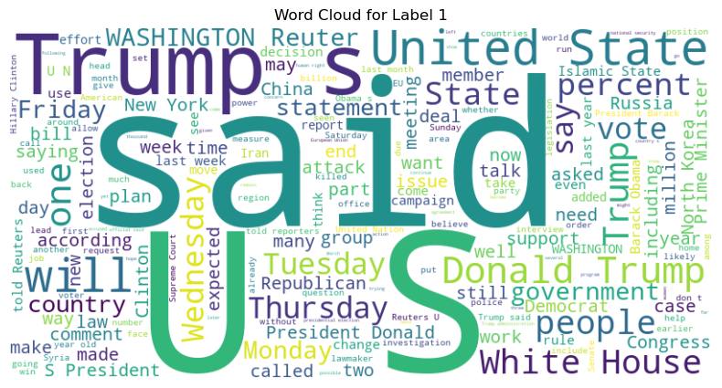
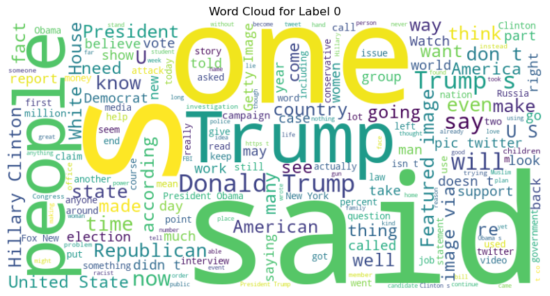
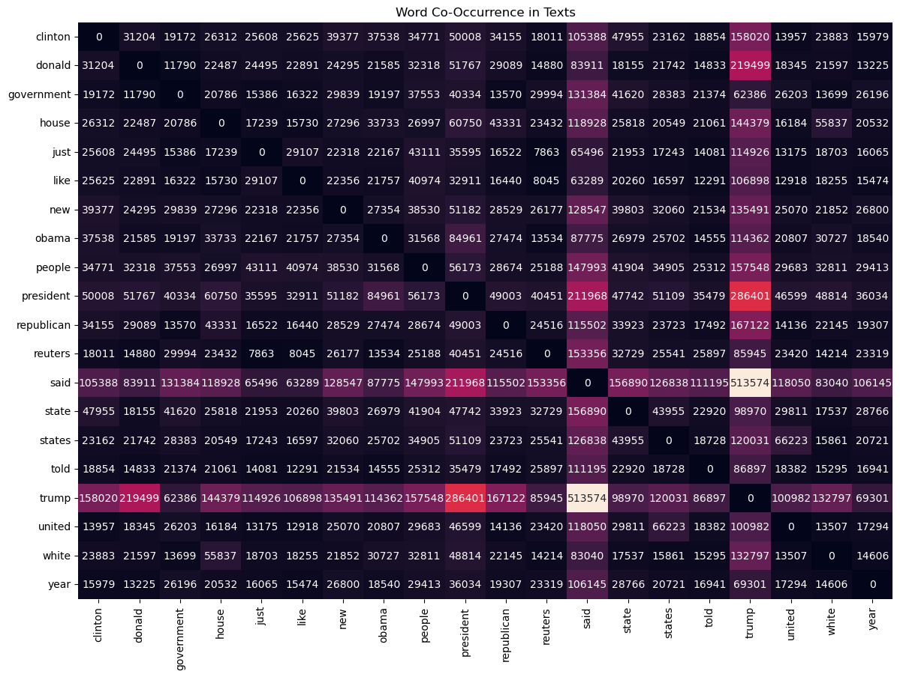
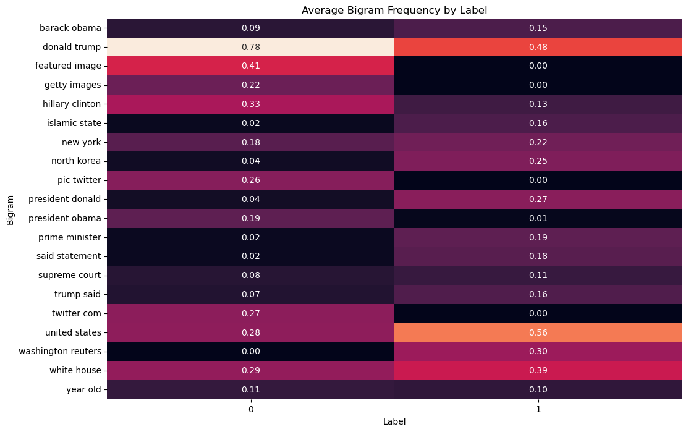

# Fake News Binary Classification

### [dataset](https://www.kaggle.com/datasets/aadyasingh55/fake-news-classification)

Author: [Kevin Thomas](mailto:ket189@pitt.edu)

License: [Apache 2.0](https://apache.org/licenses/LICENSE-2.0)

## **Executive Summary**

### **Objective**

This report presents the development and evaluation of a binary classification model designed to predict the authenticity of news articles, distinguishing between true and fake news. Utilizing a dataset of labeled news articles, the model aims to support automated fact-checking and improve the reliability of news classification systems.

### **Data Insights**

**1. Textual Analysis**
- **Label Distribution:** The dataset has a near-balanced distribution between true (54%) and fake (46%) news articles, minimizing risks associated with class imbalance.
- **Word Frequency:** Common words like "said," "trump," "state," and "reuters" indicate a focus on political and governmental topics across both labels, with distinct thematic differences between true and fake news.
- **Bigram Analysis:** Frequent phrases like “Donald Trump,” “United States,” and “White House” reflect a strong emphasis on U.S. politics and government institutions, with notable variance between labels.

**2. Sentiment and Text Features**
- **Sentiment Polarity:** Both true and fake articles have sentiment polarity centered around neutral values, indicating minimal difference in tone.
- **Text Length and Word Count:** Both labels show a positive linear relationship between text length and word count, with most articles being relatively short. True articles, on average, have slightly fewer words.
- **Average Sentence Length:** Both labels exhibit short average sentence lengths, with no significant difference between true and fake news articles.

**3. Advanced Visualizations**
- **PCA of Text Embeddings:** A 2D PCA plot shows some separation between true and fake news articles, suggesting that the embeddings capture useful information for distinguishing between labels.
- **TF-IDF Analysis:** Higher TF-IDF scores for words like “reuters” and “said” in true news and “trump” in fake news highlight key differentiating terms, with each label emphasizing different language patterns.
- **Correlation Matrix:** Word count and sentence count have a strong positive correlation (0.77), while other features show minimal correlations, indicating that text structure and sentiment are relatively independent.

### **Model Development and Selection**

**Model Evaluation**
- **5-Fold Cross-Validation:** The model consistently achieved high performance, with average metrics across folds as follows:
  - **Accuracy:** 97.33%
  - **AUC:** 0.9956
- **Best Model:** Achieved an accuracy of 97.33% and AUC of 0.9967. The model architecture includes three linear layers with ReLU activations and a Sigmoid output for binary classification.

### **Implications**

The selected model demonstrates robust performance, accurately distinguishing between true and fake news articles. Its architecture, simplicity, and effectiveness make it suitable for deployment in automated fact-checking applications. The high AUC and accuracy scores suggest that the model can reliably handle diverse news content.

### **Recommendations and Next Steps**

1. **Feature Refinement:** Further explore linguistic and sentiment-based features that may enhance model performance, focusing on distinguishing subjective language in fake news.
2. **Model Validation:** Conduct external validation using a separate dataset to assess model generalization and adaptability to new, unseen data sources.
3. **Deployment and Monitoring:** Deploy the model within news platforms for real-time article verification, with continuous monitoring to ensure consistent accuracy.

### **Conclusion**

The development of this binary classifier provides an effective tool for enhancing news verification. Through thorough analysis and robust model performance, this tool is positioned to support automated fact-checking and promote the credibility of news platforms.

## Import Main Modules & Dataset


```python
import numpy as np
import pandas as pd
import matplotlib.pyplot as plt
import seaborn as sns
```


```python
import itertools
```


```python
df1 = pd.read_csv('train (2).csv', sep=';')
```


```python
df2 = pd.read_csv('test (1).csv', sep=';')
```


```python
df3 = pd.read_csv('evaluation.csv', sep=';')
```


```python
df = pd.concat([df1, df2, df3], ignore_index=True)
```

## Perform Basic Analysis


```python
df.shape
```


    (40587, 4)


```python
df.dtypes
```


    Unnamed: 0     int64
    title         object
    text          object
    label          int64
    dtype: object


```python
_ = [print(f'{df[column].value_counts()}\n') for column in df.columns]
```

    Unnamed: 0
    0        3
    5407     3
    5420     3
    5419     3
    5418     3
            ..
    13533    1
    13534    1
    13535    1
    13536    1
    24352    1
    Name: count, Length: 24353, dtype: int64
    
    title
    no title                                                                                                                          153
    Factbox: Trump fills top jobs for his administration                                                                               14
    newsticker                                                                                                                         11
    Factbox: Contenders for senior jobs in Trump's administration                                                                       8
    Factbox: International reaction to arrest of Reuters reporters in Myanmar                                                           6
                                                                                                                                     ... 
    Moroccan police break up Islamic State cell planning attacks: ministry                                                              1
    Mike Pence VICIOUSLY Refused To Pardon Black Man Wrongfully Imprisoned For 10 Years                                                 1
    Trump approves major disaster declaration for Florida                                                                               1
    HILLARY SET TO DESTROY LIVES Of Proud, Hard-Working, Black Coal Miners To Satisfy Mostly White Environmental Activists [VIDEO]      1
    U.S. military releases, withdraws old Islamist video from Yemen raid                                                                1
    Name: count, Length: 39997, dtype: int64
    
    text
    Here s the original post by the Washington Post:It s now illegal in Russia to share an image of Putin as a gay clown https://t.co/trihoOp6nt  Washington Post (@washingtonpost) April 5, 2017Here are some of the hilarious responses:Huh. Is this illegal? pic.twitter.com/ZIK2xBHslt  Jessica   (@NoFascistsPls) April 5, 2017Like this? pic.twitter.com/YNa6CB61ML   B3r$A  (@ScamGoggles) April 6, 2017What about this pic.twitter.com/LlA6cEV6KT  Jessica   (@NoFascistsPls) April 5, 2017Really? Because I like this one. pic.twitter.com/ZiEVbUddqr  Lisa Stewart (@holachola) April 6, 2017Or this? pic.twitter.com/29syZcNkbt  Jessica   (@NoFascistsPls) April 5, 2017Well, the demand for gay Putin clowns just went up. I m gonna capitalize on this meme. pic.twitter.com/iD2wST92q9  Tyler (@Dy5function) April 5, 2017Here ya go.Courtesy of https://t.co/tJWNKZbBEv pic.twitter.com/Bi0VGOKe4a  Stranger Thingamabob (@MikeyMooseNC) April 5, 2017                                                                                                                                                                                                                                                                                                                                                                                                                                                                                                                                                                                                                                                                                                                                                                                                                                                                                                                                                                                                                                                                                                                                                                                                                                                                                                                                                                                                                                                                                                                                                                                                                                                                                                                                                                                                                                                                                                                                                                                                                                                                                                                                                                                                                                                                                                                                                                                                                                                                                                                                                                                                                                                                                                                                                                                                                                                                                                                                                                                                                                                                                                                                                                                                                                                                                                                                                                                                                                                                                                                                                                                                                                                                                                                                                                                                                                                                                                                                                                                                                                                                                                                                                                                                                                                                                                                                                                                                                                                                                                                                                                                                                                                                                                                                                                                                                                                                                                                                                                                                                                                                                                                                                                                                                                                                                                                                                                                                                                                                                                                                                                                                                                                                                                                                                                                                                                                                                                                                                                                                                                                                                                                                                                                                                                                                                                                                                                                                                                                                                                                                                                                                                                                                                                                                                                                                                                                                                                                                                                                                                                                                                                                                                                                                                                                                                                                                                                                                                                                                                                                                                                                                                                                                                                                                                                                                                                                                                                                                                                                                                                                                                                                                                                                                                                                                                                                                                                                                                                                                                                                                                                                                                                                                                                                                                                                                                                                                                                                                                                                                                                                                                                                                                                                                                                                                                                                                                                                                                                                                                                                                                                                                                                                                                                                                                                                                                                                                                                                                                                                                                                                                                                                                                                                                                                                               2
    In its 109-year history, only one F.B.I. director had been fired   until Tuesday, when President Trump fired James B. Comey. In July 1993, President Bill Clinton fired William S. Sessions, who had been nominated to the post by President Ronald Reagan in 1987. Mr. Clinton said his attorney general, Janet Reno, reviewed Mr. Sessions s leadership and concluded  in no uncertain terms that he can no longer effectively lead the bureau. Mr. Sessions had been cited for ethical lapses, including taking free trips on F.B.I. aircraft and using government money to build a $10,000 fence at his home. Mr. Sessions was asked to resign, and was fired when he refused to do so.  Despite the president s severe tone, he seemed to regret having to force Mr. Sessions from his post,  The New York Times wrote about his dismissal:WASHINGTON, July 19  President Clinton today dismissed William S. Sessions, the Director of the Federal Bureau of Investigation, who had stubbornly rejected an Administration ultimatum to resign six months after a harsh internal ethics report on his conduct.Mr. Clinton said he would announce his nominee to replace Mr. Sessions on Tuesday. He was expected to pick Judge Louis J. Freeh of Federal District Court in Manhattan; officials said Judge Freeh had impressed Mr. Clinton favorably on Friday at their first meeting.Mr. Clinton, explaining his reasons for removing Mr. Sessions, effective immediately, said,  We cannot have a leadership vacuum at an agency as important to the United States as the F.B.I. It is time that this difficult chapter in the agency s history is brought to a close.  Defiant to the EndBut in a parting news conference at F.B.I. headquarters after Mr. Clinton s announcement, a defiant Mr. Sessions   his right arm in a sling as a result of a weekend fall   railed at what he called the unfairness of his removal, which comes nearly six years into his 10-year term. Because of the scurrilous attacks on me and my wife of 42 years, it has been decided by others that I can no longer be as forceful as I need to be in leading the F.B.I. and carrying out my responsibilities to the bureau and the nation,  he said.  It is because I believe in the principle of an independent F.B.I. that I have refused to voluntarily resign. Mr. Clinton said that after reviewing Mr. Sessions s performance, Attorney General Janet Reno had advised him that Mr. Sessions should go.  After a thorough review by the Attorney General of Mr. Sessions s leadership of the F.B.I., she has reported to me in no uncertain terms that he can no longer effectively lead the bureau. Similarly, Mr. Trump fired Mr. Comey on the recommendation of his attorney general, Jeff Sessions. (No relation to William S. Sessions.) There are no United States statutes that discuss the president s authority to remove the F.B.I. director.   NYT s Vince Foster: What the Media Won t Tell You Major media outlets reported Wednesday on the Supreme Court hearing of California lawyer Allan Favish s case that government photographs of Vincent Foster s death scene be released for public viewing. The media report that no fewer than five investigations have found that Foster committed suicide because he was depressed. But despite 10 years of denial by the major media, the Foster case has not  closed    as the Supreme Court hearing Wednesday demonstrated. The case won t close because of the failure of authorities to make full disclosure   and to conduct a full investigation into the case, including a complete autopsy.Vince Foster was not only deputy White House counsel but also the personal attorney to Bill and Hillary Clinton.On the night of Foster s death, top Clinton aides made a frantic effort to enter and remove documents from his West Wing office. In the days that followed, federal investigators were stymied in their investigation of Foster s office and strange death.Since Foster s July 1993 death, the facts of his death have been obfuscated by friends of Bill and Hillary in the major media, but here s the undeniable truth:There weren t  five  investigations into Foster s death, as the media report. The Park Police, best known for their meter and horse patrols around Washington, were put in charge of the initial death inquiry of the most important federal official to die suspiciously since President Kennedy. The Park Police, contradicting standard procedure, declared the death a suicide before launching their inquiry.Later, Robert Fiske, selected by Clinton s counsel Bernie Nussbaum and Janet Reno, quickly confirmed the Park Police probe as a suicide.But when Ken Starr entered the investigation, he reopened the case. His chief prosecutor in the case, Miquel Rodriguez, later quit the Starr investigation, claiming that Starr s staff was engaging in a cover-up of Foster s death.Rodriguez, a Harvard-educated federal prosecutor, argued that one of the Polaroid photos taken of Foster at the crime scene indicated an additional wound on Foster s neck   never noted on the autopsy report. Favish s suit before the Supreme Court is seeking to release this photo, among others.No fewer than three of the paramedics on the scene indicated in reports or testimony that the crime scene was consistent with a murder scene, not a suicide.A careful FBI microscopic investigation of Foster s shoes found not a trace of soil or grass stains on them, though he supposedly walked several hundred yards through wooded Fort Marcy Park to where his body was found. [Years later, Starr s investigation found plenty of soil and grass stains. Rodriguez charged that the shoes were tampered with to produce such  evidence. ]According to the FBI report on Vince Foster s death (below) blonde hairs were found on the body of Vince Foster, but were never investigated:Foster was found with little blood around his body   and despite claims that he fired the gun into his mouth, practically no blood was found on the front of his shirt.Foster was found with a 1913 revolver no one in his family could claim, with two serial numbers, made from the parts of three or more guns. None of Foster s fingerprints were found on the gun.For years, detail after detail emerged questioning the official ruling.Significant questions were raised about the unusual gun   a .38 Colt revolver made from the parts of three guns with two serial numbers   found conveniently in Vince s hand.The Park Police said one of the serial numbers indicated the gun was vintage 1913   and had no pedigree.Foster family members insisted neither Foster nor his father ever owned the old revolver.The NCIC keeps records of all law enforcment inquiries of serial numbers.On March 23, 2001, the FBI responded to requests made by a man names Craig Brinkley:Serial number 356555, one of the numbers on the gun, was never searched, not by the FBI, the Park Police or by that  investigation  by Ken Starr.Serial number 355055 was found on the frame of the gun. Brinkley believes that was the gun s real nnumber.That number was indeed searched by the Park Police, on the evening of Foster s death, more exactly at 22:45 EDT on July 20, 1993.Interestingly, searches were conducted on the same serial number no fewer than three times earlier that year, before Foster s death, on March 3, March 7 and April 29.Was someone checking to see that this gun had a  clean  predigree and was untraceable?The bullet from the gun that supposedly killed Foster was never found, despite intensive searches.Despite claims to the contrary, no one who knew Foster, including Hillary, Web Hubbell and his own wife, saw signs of depression.A so-called suicide note was found in an office briefcase that had been searched and found to be empty after Foster s death. The note was torn into 27 pieces. Yet an FBI examination found no trace of Foster s fingerprints on the note and a top Oxford handwriting expert found the note to be an  obvious  forgery.Despite the enormity of the case, Foster s autopsy lasted an astounding 45 minutes. The coroner in the case had previously been overruled in other cases he declared  suicides  that were later found to be murders.All of the X-rays taken during the autopsy are missing.Complete crime scene photos don t exist. The Park Police said all the photos were  accidentally  overexposed. A series of close-up Polaroids, which Favish is suing for, remain. This is just a brief summary of the dozens of inconsistencies in the case. Two New York homicide investigators who looked into the case concluded that Foster s body had been moved to the crime scene and that murder could not be ruled out.Despite overwhelming evidence of a cover-up, the media won t question the official ruling.Ken Starr, who could find no criminal wrongdoing on the part of the Clintons during his  intensive  probe, confirmed a ruling of suicide. Starr even hired O.J. Simpson s defense expert to prove his case.On August 23, 2016, The Daily Mail revealed that FBI agents  reported interviews documenting that Hillary Clinton s stinging humiliation of her friend and mentor Vince Foster in front of White House aides triggered the suicide of Vince Foster were missing from where they should be filed at the National Archives.On the first visit, archivist David Paynter provided the box of records that he said contained the FBI reports of interviews conducted by FBI agents on Foster s death. On a second visit, archivist James Mathis provided what he said were those same documents.While the box contained dozens of FBI reports concerning Foster s death   including interviews with the medical examiner, U.S. Park Police officers, and White House aides about the contents of Foster s office    the reports on Hillary Clinton s role in his death were absent.After filing a Freedom of Information request with the National Archives, Martha Murphy, the archives  public liaison, reported that she directed a senior archivist to conduct a more thorough review of the relevant FBI files, including those that had not been previously made public in response to FOIA requests. He examined all eight boxes but found no interviews by any investigator that detail either a meeting between Hillary Clinton and Vince Foster or the effects of a meeting between Hillary Clinton and Vince Foster on Vince Foster s state of mind,  Murphy reported in an email.After firing Republican FBI Director William S. Session, President Bill Clinton temporarily replaced him with Floyd I. Clarke and then on September 1, 1993 he Louis Freeh became the FBI Director. Right from the start, the Freeh FBI was drenched in controversy. The  screw-ups  were legion from the exposure of fraudulent FBI crime lab results to the wrongful blaming of an innocent man for the bombings at the Atlanta Olympics to the bloody standoff and shootout at Ruby Ridge.    2
    RAMALLAH, West Bank (Reuters) - Palestinians switched off Christmas lights at Jesus  traditional birthplace in Bethlehem on Wednesday night in protest at U.S. President Donald Trump s decision to recognize Jerusalem as Israel s capital. A Christmas tree adorned with lights outside Bethlehem s Church of the Nativity, where Christians believe Jesus was born, and another in Ramallah, next to the burial site of former Palestinian leader Yasser Arafat, were plunged into darkness.  The Christmas tree was switched off on the order of the mayor today in protest at Trump s decision,  said Fady Ghattas, Bethlehem s municipal media officer.  He said it was unclear whether the illuminations would be turned on again before the main Christmas festivities. In a speech in Washington, Trump said he had decided to recognize Jerusalem as Israel s capital and move the U.S. embassy to the city. Israeli Prime Minister Benjamin Netanyahu said Trump s move  marked the beginning of a new approach to the Israeli-Palestinian conflict and said it was an  historic landmark . Arabs and Muslims across the Middle East condemned the U.S. decision, calling it an incendiary move in a volatile region and the European Union and United Nations also voiced alarm at the possible repercussions for any chances of reviving Israeli-Palestinian peacemaking.                                                                                                                                                                                                                                                                                                                                                                                                                                                                                                                                                                                                                                                                                                                                                                                                                                                                                                                                                                                                                                                                                                                                                                                                                                                                                                                                                                                                                                                                                                                                                                                                                                                                                                                                                                                                                                                                                                                                                                                                                                                                                                                                                                                                                                                                                                                                                                                                                                                                                                                                                                                                                                                                                                                                                                                                                                                                                                                                                                                                                                                                                                                                                                                                                                                                                                                                                                                                                                                                                                                                                                                                                                                                                                                                                                                                                                                                                                                                                                                                                                                                                                                                                                                                                                                                                                                                                                                                                                                                                                                                                                                                                                                                                                                                                                                                                                                                                                                                                                                                                                                                                                                                                                                                                                                                                                                                                                                                                                                                                                                                                                                                                                                                                                                                                                                                                                                                                                                                                                                                                                                                                                                                                                                                                                                                                                                                                                                                                                                                                                                                                                                                                                                                                                                                                                                                                                                                                                                                                                                                                                                                                                                                                                                                                                                                                                                                                                                                                                                                                                                                                                                                                                                                                                                                                                                                                                                                                                                                                                                                                                                                                                                                                                                                                                                                                                                                                                                                                                                                                                                                                                                                                                                                                                                                                                                                                                                                                                                                                                                                                                                                                                                                                                                                                                                                                                                                                                                                                                                                                                                                                                                                                                                                                                                                                                                                                                           1
    BUDAPEST (Reuters) - A walking tour to learn about Budapest s Muslim community and its mosques has become popular with Hungarians as a way of overcoming fears and reservations amid a strident anti-immigrant campaign by the government. Budapest-based tour operator Setamuhely (Budapest Walkshop) runs 30 different walks taking visitors around the city s architectural and cultural sites and the Jewish and Muslim communities.  I can say that this walk,  Muslims who live among us , is the most popular tour,  said Anna Lenard who runs the business. When the Muslim tour was set up three years ago very few people were interested.  Most people have never met a Muslim in their life and this ... together with what they hear every day in the media causes a lot of tension and stress in daily life. I think this is the main reason why people are coming now.  Most of the people on the four-hour walk have a college degree, and two-thirds are women, she said. Hungary s Muslim community, estimated to number about  40,000, grew with the migration crisis of 2015, though most of them arrived earlier to study at Hungarian universities.  Though hundreds of thousands of migrants crossed into Hungary from the Balkans at the peak of the crisis the majority went on to richer parts of western Europe. Data from think tank Tarki shows the proportion of people deemed to be xenophobic and resentful of foreign immigrants shot up to 60 percent this year, rising 19 points from two years ago. About 80 people go on the Muslim tour per month, the organizers said. A typical group of around 30 people first goes to a small mosque hidden in an old apartment where Muslims come to pray at the time of the visit.   I am very interested in everything multi-cultural and in cultures and religions that live among us,  said Nauszika, a psychologist who did not want to give her full name.  It is the best way to lose your fears if you start to ask the one who you (are) afraid of,  added tour leader Marianna Karman, an Africa expert who converted to Islam herself.  These people choose to come on these walks because they would like to talk about this problem. They want to fight against their fears.  Other points on the tour can include Muslim food shops and Budapest s largest mosque, located in a former office building.                                                                                                                                                                                                                                                                                                                                                                                                                                                                                                                                                                                                                                                                                                                                                                                                                                                                                                                                                                                                                                                                                                                                                                                                                                                                                                                                                                                                                                                                                                                                                                                                                                                                                                                                                                                                                                                                                                                                                                                                                                                                                                                                                                                                                                                                                                                                                                                                                                                                                                                                                                                                                                                                                                                                                                                                                                                                                                                                                                                                                                                                                                                                                                                                                                                                                                                                                                                                                                                                                                                                                                                                                                                                                                                                                                                                                                                                                                                                                                                                                                                                                                                                                                                                                                                                                                                                                                                                                                                                                                                                                                                                                                                                                                                                                                                                                                                                                                                                                                                                                                                                                                                                                                                                                                                                                                                                                                                                                                                                                                                                                                                                                                                                                                                                                                                                                                                                                                                                                                                                                                                                                                                                                                                                                                                                                                                                                                                                                                                                                                                                                                                                                                                                                                                                                                                                                                                                                                                                                                                                                                                                                                                                                                                                                                                                                                                                                                                                                                                                                                                                                                                                                                                                                                                                                                                                                                                                                                                                                                                                                                                                                                                                                                                                                                                                                                                                                                                                                                                                                                                                                                                                                                                                                                                                                                                                                                 1
    Washington (Reuters) - Republican senators trying to repeal Obamacare are forming  consensus to keep some of the U.S. healthcare law’s taxes they long criticized, in hopes of delaying more drastic funding cuts, particularly to the Medicaid program for the poor and disabled.  First proposed by moderate Republicans, the idea is gaining traction among party members, according to five sources involved in or briefed on internal discussions. While no final decisions have been made, a sense of urgency has increased as Republicans draft a replacement bill to former President Barack Obama’s healthcare law before Congress goes on recess on June 30. But keeping some of the taxes in the Senate bill risks alienating conservatives. On Tuesday, 45 conservative groups and activists sent a letter to Republican Senator Orrin Hatch of Utah, the chairman of the Senate Committee on Finance, urging the Senate to repeal all Obamacare taxes. One cornerstone tax that could remain is the net investment income tax, which imposes a 3.8 percent surtax on capital gains, dividends and interest, the sources said. The taxes most likely to be abolished directly impact consumers and the health industry, including a tax on health insurance premiums, the so-called Cadillac tax on high-cost employer-provided insurance and the medical device tax. Another proposal being floated is to keep all the taxes from the Affordable Care Act, often called Obamacare, but to scale them back. A group of 13 Republican senators led by Majority Leader Mitch McConnell has not completed a full draft of the bill, but is sending pieces to the nonpartisan Congressional Budget Office to assess the impact of various provisions. The CBO’s assessment will help determine which taxes the Senate needs in order to pay for its replacement bill. It is not clear whether McConnell, or more conservative party members such as Senator Ted Cruz of Texas and Senator Mike Lee of Utah, are receptive to keeping some of the taxes. “I think most of the taxes are going to go away,” Senator John Thune of South Dakota, the Senate’s No. 3-ranking Republican, said on Tuesday. “Our members are still having a conversation about if we want to make changes that are in the end going to require some additional revenue.” Spokesmen for McConnell and Cruz declined to comment. A spokesman for Lee said he wants Republicans to abolish every tax that was included in a 2015 Obamacare repeal bill that Obama vetoed.  Since Obamacare became law in 2010, Republicans have campaigned on repealing the program that extended insurance coverage to 20 million additional Americans through both subsidized private insurance and an expansion of Medicaid. They have argued that the law is too costly and represents undue government interference in Americans’ healthcare. President Donald Trump promised to eliminate the law on his first day in office, but Republicans, who control the White House, the House of Representatives and the Senate, have struggled to coalesce around a single plan. Under Senate rules, their bill must replicate the $133 billion in savings projected by preliminary legislation that passed in the U.S. House of Representatives last month. That bill would end Obamacare’s expansion of Medicaid in 2020, slash its federal funding by more than $800 billion over 10 years and eliminate most of the law’s taxes. Moderate Republican senators from states that expanded Medicaid, including Rob Portman of Ohio, Shelley Moore Capito of West Virginia and Dean Heller of Nevada, have proposed phasing out the expansion over a seven-year period, from 2020 to 2027, to give state governors more time to cut program costs. That timeframe also prevents senators, who serve six-year terms, from having to run for re-election when Medicaid cuts have been implemented, two former Republican Senate aides said.  Some of Obamacare’s taxes could also be repealed later when Congress tackles new legislation overhauling the U.S. tax code, two current Senate aides said.  “There’s no question that the current debate is not centered on eliminating all the taxes in Obamacare right now,” Senator Tim Scott of South Carolina said last week. Under a process called reconciliation, the bill needs at least 50 votes to pass, with Vice President Mike Pence casting the tie-breaking vote if needed. In an interview with Reuters last month, McConnell said he did not yet know how he would get enough votes for an Obamacare repeal. “Think of me with a Rubik’s cube, sitting there trying to think about what combination will get you to 50,” McConnell said.                                                                                                                                                                                                                                                                                                                                                                                                                                                                                                                                                                                                                                                                                                                                                                                                                                                                                                                                                                                                                                                                                                                                                                                                                                                                                                                                                                                                                                                                                                                                                                                                                                                                                                                                                                                                                                                                                                                                                                                                                                                                                                                                                                                                                                                                                                                                                                                                                                                                                                                                                                                                                                                                                                                                                                                                                                                                                                                                                                                                                                                                                                                                                                                                                                                                                                                                                                                                                                                                                                                                                                                                                                                                                                                                                                                                                                                                                                                                                                                                                                                                                                                                                                                                                                                                                                                                                                                                                                                                                                                                                                                                                                                                                                                                                                                                                                                                                                                                                                                                                                                                                                                                                                                                                                                                                                                                                                                                                                                                                                                                                                                                                                                                                                                                                                                                                                                                                                                                                                                                                                                                                                                                                                                                                                                                                                                                                                                                                                                              1
                                                                                                                                                                                                                                                                                                                                                                                                                                                                                                                                                                                                                                                                                                                                                                                                                                                                                                                                                                                                                                                                                                                                                                                                                                                                                                                                                                                                                                                                                                                                                                                                                                                                                                                                                                                                                                                                                                                                                                                                                                                                                                                                                                                                                                                                                                                                                                                                                                                                                                                                                                                                                                                                                                                                                                                                                                                                                                                                                                                                                                                                                                                                                                                                                                                                                                                                                                                                                                                                                                                                                                                                                                                                                                                                                                                                                                                                                                                                                                                                                                                                                                                                                                                                                                                                                                                                                                                                                                                                                                                                                                                                                                                                                                                                                                                                                                                                                                                                                                                                                                                                                                                                                                                                                                                                                                                                                                                                                                                                                                                                                                                                                                                                                                                                                                                                                                                                                                                                                                                                                                                                                                                                                                                                                                                                                                                                                                                                                                                                                                                                                                                                                                                                                                                                                                                                                                                                                                                                                                                                                                                                                                                                                                                                                                                                                                                                                                                                                                                                                                                                                                                                                                                                                                                                                                                                                                                                                                                                                                                                                                                                                                                                                                                                                                                                                                                                                                                                                                                                                                                                                                                                                                                                                                                                                                                                                                                                                                                                                                                                                                                                                                                                                                                                                                                                                                                                                                                                                                                                                                                                                                                                                                                                                                                                                                                                                                                                                                                                                                                                                                                                                                                                                                                                                                                                                                                                                                                                                                                                                                                                                                                                                                                                                                                                                                                                                                                                                                                                                                                                                                                                                                                                                                                                                                    ..
    (Reuters) - A raucous Republican Party debate on Thursday drew the biggest audience for a televised U.S. presidential match-up in 2016, according to early ratings data, but viewership was well below the record set last August. The Fox News Channel (FOXA.O) debate among Republican front-runner Donald Trump, Marco Rubio, Ted Cruz and John Kasich drew 16.9 million viewers, according to early Nielsen data provided by the network on Friday. That was higher than the last Republican Party debate, which aired on cable channel CNN and Telemundo on Feb. 25 and brought in a TV audience of 14.5 million. Republican debates have drawn much higher TV audiences in this U.S. presidential cycle than those involving Democrats.  The debate was the four remaining candidates’ first face-to-face encounter since Super Tuesday nominating contests this week gave extra momentum to Trump but did not knock out his rivals.[L2N16C03W] Fox News holds the record for the largest audience for a non-sports cable TV program. Some 24 million Americans tuned in when it hosted the first of the U.S. presidential debates in August 2015. Thursday’s debate in Detroit was the second-highest rated telecast in network history, Fox said. At Thursday’s debate, Trump’s rivals assailed him for shifting positions on the issues but said in the end they would reluctantly support him if he were their party’s nominee.     (Reporting by Jill Serjeant and Emily Stephenson; Editing by Alistair Bell and Bill Trott; For more on the 2016 U.S. presidential race and to learn about the undecided voters who determine elections, visit the Reuters website.; here) This article was funded in part by SAP. It was independently created by the Reuters editorial staff. SAP had no editorial involvement in its creation or production.                                                                                                                                                                                                                                                                                                                                                                                                                                                                                                                                                                                                                                                                                                                                                                                                                                                                                                                                                                                                                                                                                                                                                                                                                                                                                                                                                                                                                                                                                                                                                                                                                                                                                                                                                                                                                                                                                                                                                                                                                                                                                                                                                                                                                                                                                                                                                                                                                                                                                                                                                                                                                                                                                                                                                                                                                                                                                                                                                                                                                                                                                                                                                                                                                                                                                                                                                                                                                                                                                                                                                                                                                                                                                                                                                                                                                                                                                                                                                                                                                                                                                                                                                                                                                                                                                                                                                                                                                                                                                                                                                                                                                                                                                                                                                                                                                                                                                                                                                                                                                                                                                                                                                                                                                                                                                                                                                                                                                                                                                                                                                                                                                                                                                                                                                                                                                                                                                                                                                                                                                                                                                                                                                                                                                                                                                                                                                                                                                                                                                                                                                                                                                                                                                                                                                                                                                                                                                                                                                                                                                                                                                                                                                                                                                                                                                                                                                                                                                                                                                                                                                                                                                                                                                                                                                                                                                                                                                                                                                                                                                                                                                                                                                                                                                                                                                                                                                                                                                                                                                                                                                                                                                                                                                                                                                                                                                                                                                                                                                                                                                                                                                                                                                                                                                                                                                                                                                                     1
    JERUSALEM (Reuters) - “I love the people in this room. I love Israel. I love Israel,” Donald Trump told a convention of pro-Israel lobbyists in Washington this week. But the feeling still isn’t quite mutual. At least not yet. In Israel, where distrust of Democratic President Barack Obama runs deep and conservative Benjamin Netanyahu is in his fourth term as prime minister, many voters might have been expected to prefer a Republican to take the White House. But the prospect that the candidate could be Trump — the real estate billionaire whose rhetoric toward ethnic minorities is widely viewed as inflammatory and whose proposal to ban Muslims from entering the United States would affect nearly a fifth of Israelis — has alarmed politicians and voters alike. An opinion poll published last week on Israel’s Walla news site showed that 23 percent of Israelis want to see Trump in the Oval Office, compared to 38 percent who prefer the Democrats’ frontrunner, ex-Secretary of State Hillary Clinton. In December Trump called off a visit to Israel, saying he did not want to cause difficulty for Netanyahu, after Trump’s proposal to ban Muslims from the United States drew an outcry. Netanyahu said at the time he was willing to meet any serious U.S. candidate, but strongly rejected Trump’s views on Muslims, saying Israel “respects all religions and diligently guards the rights of its citizens”. Dozens of Israeli opposition lawmakers had signed a letter demanding Netanyahu call off the planned meeting. The letter’s author said Trump’s “racist” remarks meant plans for the prime minister to meet him were “disgracing Israel’s democratic character and hurting its Muslim citizens”. One signatory, an Israeli Arab lawmaker, called Trump a “neo-Nazi”. Three months later, with Trump now on course for his party’s nomination, his speech on Monday to the American Israel Public Affairs Committee seemed designed to shift perceptions of him squarely back towards the Republican mainstream. “Trump delivered a speech that could easily have been written in the Prime Minister’s Office in Jerusalem,” wrote Chemi Shalev, correspondent for Israeli newspaper Haaretz. “He went into the arena as a racist demagogue but soon came out as an ostensibly serious contender.” Trump, who normally disdains prepared remarks, read his speech out from a teleprompter. His criticism of Obama won applause from the room, and he noted that his daughter Ivanka, who converted to Judaism and married a Jewish man, will soon give birth to a “beautiful Jewish baby”. Unlike Clinton, who spoke at the gathering in a morning session on Monday, Trump made no mention of a main sticking point in a now-dormant peace process — Jewish settlement on occupied land that Palestinians seek for a state. Instead, he pushed all the traditional applause buttons at a high-energy event replete with swelling music, accounts of Israeli high-tech achievements and shots of waving, and sometimes kissing, audience members displayed on a big screen. Among Trump’s promises: dismantling a nuclear deal with Iran, vetoing any attempt by the United Nations to impose a peace settlement and moving the American embassy from Tel Aviv to Jerusalem, which Israel considers its capital but almost all other countries, including the United States, do not. Still, Trump will have a way to go to win over many in a country suspicious of populist rhetoric. “He is a chauvinist, a violent person who hates the blacks, the Arabs - anyone who is not his color,” said Orly Marx, a 55-year-old housewife from Herzliya, near Tel Aviv. Part of Trump’s difficulty in winning over Israelis is a message that has so far appeared inconsistent. Israelis are used to pouring carefully over U.S. signals toward their country for even the slightest deviation from established policies. Israel Radio noted on Tuesday that hours before giving his pro-Israel speech, Trump said at a news conference that U.S. allies would have to pay more for American military aid. Trump quickly backtracked, saying that Israel, which is locked in sensitive negotiations with the Obama administration over a new multi-billion-dollar 10-year military assistance package, “can help us greatly”. Clinton and Trump’s Republican rivals criticized him for having said he would be “neutral” in negotiations between Israel and the Palestinians. American politicians from both parties portray Israel as a close ally, even if they believe it should do more to meet Palestinian demands in negotiations. Nevertheless, the right-leaning politics of many Israeli voters means Trump could become more popular if he emerges as the Republican nominee. Nina Gilbert, 47, an American-Israeli who works in Israel’s high-tech sector, said Israelis were simply looking forward to the day Obama leaves the White House. “As far as they are concerned, anybody who is not Obama is better,” she said.                                                                                                                                                                                                                                                                                                                                                                                                                                                                                                                                                                                                                                                                                                                                                                                                                                                                                                                                                                                                                                                                                                                                                                                                                                                                                                                                                                                                                                                                                                                                                                                                                                                                                                                                                                                                                                                                                                                                                                                                                                                                                                                                                                                                                                                                                                                                                                                                                                                                                                                                                                                                                                                                                                                                                                                                                                                                                                                                                                                                                                                                                                                                                                                                                                                                                                                                                                                                                                                                                                                                                                                                                                                                                                                                                                                                                                                                                                                                                                                                                                                                                                                                                                                                                                                                                                                                                                                                                                                                                                                                                                                                                                                                                                                                                                                                                                                                                                                                                                                                                                                                                                                                                                                                                                                                                                                                                                                                                                                                                                                                                                                                                                                                                                                                                                                                                                                                                                                                                                                                                                                                                                                                          1
    The audio of Hillary Clinton laughing about getting a child rapist a lighter sentence is pretty shocking for a couple of reasons: The accent on Hillary is very different from the many other accents she s presented to the public. It s strange because she s from Illinois! What the heck! Check it out and tell us what you think. The other thing that s so shocking is Hillary s blatant disregard for the victim in this case. It s actually really sickening to hear her speak of the 12-year old with such disregard. It s rare that we get a glimpse into the REAL Hillary so here it is in all its glory pretty scary huh?A child rape victim says she cannot forgive Hillary Clinton for defending her rapist in court 40 years ago, saying the Democratic presidential candidate attacked her credibility despite knowing that her assailant was guilty   and later laughed about it in a taped interview.Kathy Shelton was just 12 years old when a 41-year-old drifter raped her on the side of a desolate Arkansas road in 1975.Now, four decades later, she has agreed to be named and pictured for the first time in this Daily Mail Online exclusive because she is furious that her rapist s defense attorney   Hillary Clinton   has been portraying herself as a lifelong advocate of women and girls on the campaign trail. It s put a lot of anger back in me,  said Shelton, now 54, in an exclusive interview at her Springdale, Arkansas, home in August.  Every time I see [Clinton] on TV I just want to reach in there and grab her, but I can t do that. In 1975, Clinton served as the defense lawyer for Thomas Alfred Taylor, a 41-year-old factory worker accused of raping Shelton after luring her to his car.Taylor pleaded down to  unlawful fondling of a minor  and served less than a year in prison after Clinton was able to block the admission of forensic evidence that linked her client to the crime.In a lengthy interview with the Daily Mail Online, Shelton said Clinton is  lying  when she claims to be a lifelong defender of women and girls. HILLARY LAUGHS WHEN DISCUSSING GETTING CHILD RAPIST OFF WITH LIGHT SENTENCE: https://www.youtube.com/watch?v=Tor00iWUhDQRead more: Daily Mail                                                                                                                                                                                                                                                                                                                                                                                                                                                                                                                                                                                                                                                                                                                                                                                                                                                                                                                                                                                                                                                                                                                                                                                                                                                                                                                                                                                                                                                                                                                                                                                                                                                                                                                                                                                                                                                                                                                                                                                                                                                                                                                                                                                                                                                                                                                                                                                                                                                                                                                                                                                                                                                                                                                                                                                                                                                                                                                                                                                                                                                                                                                                                                                                                                                                                                                                                                                                                                                                                                                                                                                                                                                                                                                                                                                                                                                                                                                                                                                                                                                                                                                                                                                                                                                                                                                                                                                                                                                                                                                                                                                                                                                                                                                                                                                                                                                                                                                                                                                                                                                                                                                                                                                                                                                                                                                                                                                                                                                                                                                                                                                                                                                                                                                                                                                                                                                                                                                                                                                                                                                                                                                                                                                                                                                                                                                                                                                                                                                                                                                                                                                                                                                                                                                                                                                                                                                                                                                                                                                                                                                                                                                                                                                                                                                                                                                                                                                                                                                                                                                                                                                                                                                                                                                                                                                                                                                                                                                                                                                                                                                                                                                                                                                                                                                                                                                                                                                                                                                                                                                                                                                                                                                                                                                                                                                                                                                                                                                                                                             1
    If you ve donated to the Republican party, this is where your money s going. This is why so many people donate directly to the candidate and skip the Republican party donations. Party leaders aka elites will meet to discuss how to screw Trump out of the nomination. Even if you don t support Trump, this is dirty politics by the establishment that stinks to high heaven PEE YEW!RNC party leaders are expected to discuss GOP front-runner Donald Trump s delegates thus far at the Hollywood, Florida Diplomat Resort & Spa, which also includes a party on a 128-foot yacht, according to a report by CNN.The party s rules panel will meet Thursday to decide whether any nominating boundaries should be proposed for the convention, but the real fighting, haggling and negotiating will be taking place on the sidelines   over drinks and around the pool at this resort. One of the first confrontations is set for when conservatives meet Wednesday morning to hash out a fight over convention and nomination rules that started last week and played out over the weekend. Conservative RNC member Solomon Yue is pressing his colleagues to send a rules plan to the convention delegates   like they typically do   when they meet this week. But John Ryder, an ally of RNC Chairman Reince Priebus, is arguing same case inside the private meeting that Priebus has been making for more than a week: Don t go anywhere near the convention rules. The yacht party can accommodate 550 people, and includes 18,000 feet of deck space, a covered sky lounge, two sun decks and 13 high-definition televisions.Read more: bpr                                                                                                                                                                                                                                                                                                                                                                                                                                                                                                                                                                                                                                                                                                                                                                                                                                                                                                                                                                                                                                                                                                                                                                                                                                                                                                                                                                                                                                                                                                                                                                                                                                                                                                                                                                                                                                                                                                                                                                                                                                                                                                                                                                                                                                                                                                                                                                                                                                                                                                                                                                                                                                                                                                                                                                                                                                                                                                                                                                                                                                                                                                                                                                                                                                                                                                                                                                                                                                                                                                                                                                                                                                                                                                                                                                                                                                                                                                                                                                                                                                                                                                                                                                                                                                                                                                                                                                                                                                                                                                                                                                                                                                                                                                                                                                                                                                                                                                                                                                                                                                                                                                                                                                                                                                                                                                                                                                                                                                                                                                                                                                                                                                                                                                                                                                                                                                                                                                                                                                                                                                                                                                                                                                                                                                                                                                                                                                                                                                                                                                                                                                                                                                                                                                                                                                                                                                                                                                                                                                                                                                                                                                                                                                                                                                                                                                                                                                                                                                                                                                                                                                                                                                                                                                                                                                                                                                                                                                                                                                                                                                                                                                                                                                                                                                                                                                                                                                                                                                                                                                                                                                                                                                                                                                                                                                                                                                                                                                                                                                                                                                                                                                                                                                                                                                                                                                                                                                                                                                                                                                                                                                         1
    WASHINGTON (Reuters) - In an awkward reversal, the U.S. military promptly withdrew an old video by Islamist militants it had released on Friday as evidence that a fatal raid in Yemen by American special forces this week was a counter terrorism success.  An expert in radical Islamist media said the footage by unknown militants appeared to be part of videos first released by jihadists online some 10 years ago, undermining the Pentagon’s explanation about its value.  A U.S. Central Command spokesman confirmed that the video was removed from the website because the contents were old.    “We didn’t want it to appear that we were trying to pass off an old video as a new video,” spokesman Colonel John Thomas said. It is the latest controversy surrounding the raid on a branch of al Qaeda in Yemen, the first such operation authorized by President Donald Trump as commander in chief. The military said the video was found on Sunday in the operation in al-Bayda province in which a U.S. Navy SEAL, militants and civilians were killed.      A U.S. Central Command spokesman had said on Friday the clip of a ski-masked man encouraging people to build bombs, was “one example of the volumes of sensitive al-Qa’eda terror-planning information recovered during the operation.”  The Department of Defense posted the video on its web site on Friday but pulled it off within several hours when questions began to arise about its age.     The footage appeared to be similar to that in other videos that surfaced online in 2007.  “The video clip that was posted and abruptly taken down was one of 25 videos that appeared (published) in 2007,” said Adam Raisman, a senior analyst at SITE group which monitors extremists online. He added that the only difference was that the Pentagon video had English subtitles added.        Pentagon spokesman Captain Jeff Davis said the video was still of worth, even if it may have been created earlier.  “It does not matter when the video was made, that they had it is still illustrative of who they are and what their intentions are,” Davis said.      U.S. Navy SEAL William “Ryan” Owens was killed in the raid, which the Pentagon said also killed 14 militants. Medics at the scene said about 30 people, including 10 women and children, also died. U.S. military officials told Reuters this week that the operation went ahead without sufficient intelligence, ground support or adequate backup preparations.  As a result, three officials said, the attacking SEAL team found itself dropping onto a reinforced al Qaeda base defended by landmines, snipers, and a larger than expected contingent of heavily armed Islamist extremists.         But Central Command said earlier this week that it only asks for operations it believes have a good chance of success based on its planning. Pentagon spokesman Davis has said the element of surprise had not been lost in the raid.                                                                                                                                                                                                                                                                                                                                                                                                                                                                                                                                                                                                                                                                                                                                                                                                                                                                                                                                                                                                                                                                                                                                                                                                                                                                                                                                                                                                                                                                                                                                                                                                                                                                                                                                                                                                                                                                                                                                                                                                                                                                                                                                                                                                                                                                                                                                                                                                                                                                                                                                                                                                                                                                                                                                                                                                                                                                                                                                                                                                                                                                                                                                                                                                                                                                                                                                                                                                                                                                                                                                                                                                                                                                                                                                                                                                                                                                                                                                                                                                                                                                                                                                                                                                                                                                                                                                                                                                                                                                                                                                                                                                                                                                                                                                                                                                                                                                                                                                                                                                                                                                                                                                                                                                                                                                                                                                                                                                                                                                                                                                                                                                                                                                                                                                                                                                                                                                                                                                                                                                                                                                                                                                                                                                                                                                                                                                                                                                                                                                                                                                                                                                                                                                                                                                                                                                                                                                                                                                                                                                                                                                                                                                                                                                                                                                                                                                                                                                                                                                                                                                                                                                                                                                                                                                                                                                                                                                                                                                                                                                                                                                                                                                                                                                                   1
    Name: count, Length: 40585, dtype: int64
    
    label
    1    21924
    0    18663
    Name: count, dtype: int64
    


```python
df.nunique()
```


    Unnamed: 0    24353
    title         39997
    text          40585
    label             2
    dtype: int64


```python
df['Unnamed: 0']
```


    0           0
    1           1
    2           2
    3           3
    4           4
             ... 
    40582    8112
    40583    8113
    40584    8114
    40585    8115
    40586    8116
    Name: Unnamed: 0, Length: 40587, dtype: int64


```python
df.label
```


    0        1
    1        1
    2        0
    3        1
    4        0
            ..
    40582    0
    40583    0
    40584    0
    40585    1
    40586    1
    Name: label, Length: 40587, dtype: int64


```python
df.label.value_counts()
```


    label
    1    21924
    0    18663
    Name: count, dtype: int64


## Verify/Handle Missing Values 


```python
df.isna().sum()
```


    Unnamed: 0    0
    title         0
    text          0
    label         0
    dtype: int64


## Drop Irrelevant Variables


```python
df = df.drop(columns=['Unnamed: 0'])
```

## Perform Basic Analysis - Cleaned Dataset


```python
df.shape
```


    (40587, 3)


```python
df.dtypes
```


    title    object
    text     object
    label     int64
    dtype: object


```python
_ = [print(f'{df[column].value_counts()}\n') for column in df.columns]
```

    title
    no title                                                                                                                          153
    Factbox: Trump fills top jobs for his administration                                                                               14
    newsticker                                                                                                                         11
    Factbox: Contenders for senior jobs in Trump's administration                                                                       8
    Factbox: International reaction to arrest of Reuters reporters in Myanmar                                                           6
                                                                                                                                     ... 
    Moroccan police break up Islamic State cell planning attacks: ministry                                                              1
    Mike Pence VICIOUSLY Refused To Pardon Black Man Wrongfully Imprisoned For 10 Years                                                 1
    Trump approves major disaster declaration for Florida                                                                               1
    HILLARY SET TO DESTROY LIVES Of Proud, Hard-Working, Black Coal Miners To Satisfy Mostly White Environmental Activists [VIDEO]      1
    U.S. military releases, withdraws old Islamist video from Yemen raid                                                                1
    Name: count, Length: 39997, dtype: int64
    
    text
    Here s the original post by the Washington Post:It s now illegal in Russia to share an image of Putin as a gay clown https://t.co/trihoOp6nt  Washington Post (@washingtonpost) April 5, 2017Here are some of the hilarious responses:Huh. Is this illegal? pic.twitter.com/ZIK2xBHslt  Jessica   (@NoFascistsPls) April 5, 2017Like this? pic.twitter.com/YNa6CB61ML   B3r$A  (@ScamGoggles) April 6, 2017What about this pic.twitter.com/LlA6cEV6KT  Jessica   (@NoFascistsPls) April 5, 2017Really? Because I like this one. pic.twitter.com/ZiEVbUddqr  Lisa Stewart (@holachola) April 6, 2017Or this? pic.twitter.com/29syZcNkbt  Jessica   (@NoFascistsPls) April 5, 2017Well, the demand for gay Putin clowns just went up. I m gonna capitalize on this meme. pic.twitter.com/iD2wST92q9  Tyler (@Dy5function) April 5, 2017Here ya go.Courtesy of https://t.co/tJWNKZbBEv pic.twitter.com/Bi0VGOKe4a  Stranger Thingamabob (@MikeyMooseNC) April 5, 2017                                                                                                                                                                                                                                                                                                                                                                                                                                                                                                                                                                                                                                                                                                                                                                                                                                                                                                                                                                                                                                                                                                                                                                                                                                                                                                                                                                                                                                                                                                                                                                                                                                                                                                                                                                                                                                                                                                                                                                                                                                                                                                                                                                                                                                                                                                                                                                                                                                                                                                                                                                                                                                                                                                                                                                                                                                                                                                                                                                                                                                                                                                                                                                                                                                                                                                                                                                                                                                                                                                                                                                                                                                                                                                                                                                                                                                                                                                                                                                                                                                                                                                                                                                                                                                                                                                                                                                                                                                                                                                                                                                                                                                                                                                                                                                                                                                                                                                                                                                                                                                                                                                                                                                                                                                                                                                                                                                                                                                                                                                                                                                                                                                                                                                                                                                                                                                                                                                                                                                                                                                                                                                                                                                                                                                                                                                                                                                                                                                                                                                                                                                                                                                                                                                                                                                                                                                                                                                                                                                                                                                                                                                                                                                                                                                                                                                                                                                                                                                                                                                                                                                                                                                                                                                                                                                                                                                                                                                                                                                                                                                                                                                                                                                                                                                                                                                                                                                                                                                                                                                                                                                                                                                                                                                                                                                                                                                                                                                                                                                                                                                                                                                                                                                                                                                                                                                                                                                                                                                                                                                                                                                                                                                                                                                                                                                                                                                                                                                                                                                                                                                                                                                                                                                                                                                                               2
    In its 109-year history, only one F.B.I. director had been fired   until Tuesday, when President Trump fired James B. Comey. In July 1993, President Bill Clinton fired William S. Sessions, who had been nominated to the post by President Ronald Reagan in 1987. Mr. Clinton said his attorney general, Janet Reno, reviewed Mr. Sessions s leadership and concluded  in no uncertain terms that he can no longer effectively lead the bureau. Mr. Sessions had been cited for ethical lapses, including taking free trips on F.B.I. aircraft and using government money to build a $10,000 fence at his home. Mr. Sessions was asked to resign, and was fired when he refused to do so.  Despite the president s severe tone, he seemed to regret having to force Mr. Sessions from his post,  The New York Times wrote about his dismissal:WASHINGTON, July 19  President Clinton today dismissed William S. Sessions, the Director of the Federal Bureau of Investigation, who had stubbornly rejected an Administration ultimatum to resign six months after a harsh internal ethics report on his conduct.Mr. Clinton said he would announce his nominee to replace Mr. Sessions on Tuesday. He was expected to pick Judge Louis J. Freeh of Federal District Court in Manhattan; officials said Judge Freeh had impressed Mr. Clinton favorably on Friday at their first meeting.Mr. Clinton, explaining his reasons for removing Mr. Sessions, effective immediately, said,  We cannot have a leadership vacuum at an agency as important to the United States as the F.B.I. It is time that this difficult chapter in the agency s history is brought to a close.  Defiant to the EndBut in a parting news conference at F.B.I. headquarters after Mr. Clinton s announcement, a defiant Mr. Sessions   his right arm in a sling as a result of a weekend fall   railed at what he called the unfairness of his removal, which comes nearly six years into his 10-year term. Because of the scurrilous attacks on me and my wife of 42 years, it has been decided by others that I can no longer be as forceful as I need to be in leading the F.B.I. and carrying out my responsibilities to the bureau and the nation,  he said.  It is because I believe in the principle of an independent F.B.I. that I have refused to voluntarily resign. Mr. Clinton said that after reviewing Mr. Sessions s performance, Attorney General Janet Reno had advised him that Mr. Sessions should go.  After a thorough review by the Attorney General of Mr. Sessions s leadership of the F.B.I., she has reported to me in no uncertain terms that he can no longer effectively lead the bureau. Similarly, Mr. Trump fired Mr. Comey on the recommendation of his attorney general, Jeff Sessions. (No relation to William S. Sessions.) There are no United States statutes that discuss the president s authority to remove the F.B.I. director.   NYT s Vince Foster: What the Media Won t Tell You Major media outlets reported Wednesday on the Supreme Court hearing of California lawyer Allan Favish s case that government photographs of Vincent Foster s death scene be released for public viewing. The media report that no fewer than five investigations have found that Foster committed suicide because he was depressed. But despite 10 years of denial by the major media, the Foster case has not  closed    as the Supreme Court hearing Wednesday demonstrated. The case won t close because of the failure of authorities to make full disclosure   and to conduct a full investigation into the case, including a complete autopsy.Vince Foster was not only deputy White House counsel but also the personal attorney to Bill and Hillary Clinton.On the night of Foster s death, top Clinton aides made a frantic effort to enter and remove documents from his West Wing office. In the days that followed, federal investigators were stymied in their investigation of Foster s office and strange death.Since Foster s July 1993 death, the facts of his death have been obfuscated by friends of Bill and Hillary in the major media, but here s the undeniable truth:There weren t  five  investigations into Foster s death, as the media report. The Park Police, best known for their meter and horse patrols around Washington, were put in charge of the initial death inquiry of the most important federal official to die suspiciously since President Kennedy. The Park Police, contradicting standard procedure, declared the death a suicide before launching their inquiry.Later, Robert Fiske, selected by Clinton s counsel Bernie Nussbaum and Janet Reno, quickly confirmed the Park Police probe as a suicide.But when Ken Starr entered the investigation, he reopened the case. His chief prosecutor in the case, Miquel Rodriguez, later quit the Starr investigation, claiming that Starr s staff was engaging in a cover-up of Foster s death.Rodriguez, a Harvard-educated federal prosecutor, argued that one of the Polaroid photos taken of Foster at the crime scene indicated an additional wound on Foster s neck   never noted on the autopsy report. Favish s suit before the Supreme Court is seeking to release this photo, among others.No fewer than three of the paramedics on the scene indicated in reports or testimony that the crime scene was consistent with a murder scene, not a suicide.A careful FBI microscopic investigation of Foster s shoes found not a trace of soil or grass stains on them, though he supposedly walked several hundred yards through wooded Fort Marcy Park to where his body was found. [Years later, Starr s investigation found plenty of soil and grass stains. Rodriguez charged that the shoes were tampered with to produce such  evidence. ]According to the FBI report on Vince Foster s death (below) blonde hairs were found on the body of Vince Foster, but were never investigated:Foster was found with little blood around his body   and despite claims that he fired the gun into his mouth, practically no blood was found on the front of his shirt.Foster was found with a 1913 revolver no one in his family could claim, with two serial numbers, made from the parts of three or more guns. None of Foster s fingerprints were found on the gun.For years, detail after detail emerged questioning the official ruling.Significant questions were raised about the unusual gun   a .38 Colt revolver made from the parts of three guns with two serial numbers   found conveniently in Vince s hand.The Park Police said one of the serial numbers indicated the gun was vintage 1913   and had no pedigree.Foster family members insisted neither Foster nor his father ever owned the old revolver.The NCIC keeps records of all law enforcment inquiries of serial numbers.On March 23, 2001, the FBI responded to requests made by a man names Craig Brinkley:Serial number 356555, one of the numbers on the gun, was never searched, not by the FBI, the Park Police or by that  investigation  by Ken Starr.Serial number 355055 was found on the frame of the gun. Brinkley believes that was the gun s real nnumber.That number was indeed searched by the Park Police, on the evening of Foster s death, more exactly at 22:45 EDT on July 20, 1993.Interestingly, searches were conducted on the same serial number no fewer than three times earlier that year, before Foster s death, on March 3, March 7 and April 29.Was someone checking to see that this gun had a  clean  predigree and was untraceable?The bullet from the gun that supposedly killed Foster was never found, despite intensive searches.Despite claims to the contrary, no one who knew Foster, including Hillary, Web Hubbell and his own wife, saw signs of depression.A so-called suicide note was found in an office briefcase that had been searched and found to be empty after Foster s death. The note was torn into 27 pieces. Yet an FBI examination found no trace of Foster s fingerprints on the note and a top Oxford handwriting expert found the note to be an  obvious  forgery.Despite the enormity of the case, Foster s autopsy lasted an astounding 45 minutes. The coroner in the case had previously been overruled in other cases he declared  suicides  that were later found to be murders.All of the X-rays taken during the autopsy are missing.Complete crime scene photos don t exist. The Park Police said all the photos were  accidentally  overexposed. A series of close-up Polaroids, which Favish is suing for, remain. This is just a brief summary of the dozens of inconsistencies in the case. Two New York homicide investigators who looked into the case concluded that Foster s body had been moved to the crime scene and that murder could not be ruled out.Despite overwhelming evidence of a cover-up, the media won t question the official ruling.Ken Starr, who could find no criminal wrongdoing on the part of the Clintons during his  intensive  probe, confirmed a ruling of suicide. Starr even hired O.J. Simpson s defense expert to prove his case.On August 23, 2016, The Daily Mail revealed that FBI agents  reported interviews documenting that Hillary Clinton s stinging humiliation of her friend and mentor Vince Foster in front of White House aides triggered the suicide of Vince Foster were missing from where they should be filed at the National Archives.On the first visit, archivist David Paynter provided the box of records that he said contained the FBI reports of interviews conducted by FBI agents on Foster s death. On a second visit, archivist James Mathis provided what he said were those same documents.While the box contained dozens of FBI reports concerning Foster s death   including interviews with the medical examiner, U.S. Park Police officers, and White House aides about the contents of Foster s office    the reports on Hillary Clinton s role in his death were absent.After filing a Freedom of Information request with the National Archives, Martha Murphy, the archives  public liaison, reported that she directed a senior archivist to conduct a more thorough review of the relevant FBI files, including those that had not been previously made public in response to FOIA requests. He examined all eight boxes but found no interviews by any investigator that detail either a meeting between Hillary Clinton and Vince Foster or the effects of a meeting between Hillary Clinton and Vince Foster on Vince Foster s state of mind,  Murphy reported in an email.After firing Republican FBI Director William S. Session, President Bill Clinton temporarily replaced him with Floyd I. Clarke and then on September 1, 1993 he Louis Freeh became the FBI Director. Right from the start, the Freeh FBI was drenched in controversy. The  screw-ups  were legion from the exposure of fraudulent FBI crime lab results to the wrongful blaming of an innocent man for the bombings at the Atlanta Olympics to the bloody standoff and shootout at Ruby Ridge.    2
    RAMALLAH, West Bank (Reuters) - Palestinians switched off Christmas lights at Jesus  traditional birthplace in Bethlehem on Wednesday night in protest at U.S. President Donald Trump s decision to recognize Jerusalem as Israel s capital. A Christmas tree adorned with lights outside Bethlehem s Church of the Nativity, where Christians believe Jesus was born, and another in Ramallah, next to the burial site of former Palestinian leader Yasser Arafat, were plunged into darkness.  The Christmas tree was switched off on the order of the mayor today in protest at Trump s decision,  said Fady Ghattas, Bethlehem s municipal media officer.  He said it was unclear whether the illuminations would be turned on again before the main Christmas festivities. In a speech in Washington, Trump said he had decided to recognize Jerusalem as Israel s capital and move the U.S. embassy to the city. Israeli Prime Minister Benjamin Netanyahu said Trump s move  marked the beginning of a new approach to the Israeli-Palestinian conflict and said it was an  historic landmark . Arabs and Muslims across the Middle East condemned the U.S. decision, calling it an incendiary move in a volatile region and the European Union and United Nations also voiced alarm at the possible repercussions for any chances of reviving Israeli-Palestinian peacemaking.                                                                                                                                                                                                                                                                                                                                                                                                                                                                                                                                                                                                                                                                                                                                                                                                                                                                                                                                                                                                                                                                                                                                                                                                                                                                                                                                                                                                                                                                                                                                                                                                                                                                                                                                                                                                                                                                                                                                                                                                                                                                                                                                                                                                                                                                                                                                                                                                                                                                                                                                                                                                                                                                                                                                                                                                                                                                                                                                                                                                                                                                                                                                                                                                                                                                                                                                                                                                                                                                                                                                                                                                                                                                                                                                                                                                                                                                                                                                                                                                                                                                                                                                                                                                                                                                                                                                                                                                                                                                                                                                                                                                                                                                                                                                                                                                                                                                                                                                                                                                                                                                                                                                                                                                                                                                                                                                                                                                                                                                                                                                                                                                                                                                                                                                                                                                                                                                                                                                                                                                                                                                                                                                                                                                                                                                                                                                                                                                                                                                                                                                                                                                                                                                                                                                                                                                                                                                                                                                                                                                                                                                                                                                                                                                                                                                                                                                                                                                                                                                                                                                                                                                                                                                                                                                                                                                                                                                                                                                                                                                                                                                                                                                                                                                                                                                                                                                                                                                                                                                                                                                                                                                                                                                                                                                                                                                                                                                                                                                                                                                                                                                                                                                                                                                                                                                                                                                                                                                                                                                                                                                                                                                                                                                                                                                                                                                                                           1
    BUDAPEST (Reuters) - A walking tour to learn about Budapest s Muslim community and its mosques has become popular with Hungarians as a way of overcoming fears and reservations amid a strident anti-immigrant campaign by the government. Budapest-based tour operator Setamuhely (Budapest Walkshop) runs 30 different walks taking visitors around the city s architectural and cultural sites and the Jewish and Muslim communities.  I can say that this walk,  Muslims who live among us , is the most popular tour,  said Anna Lenard who runs the business. When the Muslim tour was set up three years ago very few people were interested.  Most people have never met a Muslim in their life and this ... together with what they hear every day in the media causes a lot of tension and stress in daily life. I think this is the main reason why people are coming now.  Most of the people on the four-hour walk have a college degree, and two-thirds are women, she said. Hungary s Muslim community, estimated to number about  40,000, grew with the migration crisis of 2015, though most of them arrived earlier to study at Hungarian universities.  Though hundreds of thousands of migrants crossed into Hungary from the Balkans at the peak of the crisis the majority went on to richer parts of western Europe. Data from think tank Tarki shows the proportion of people deemed to be xenophobic and resentful of foreign immigrants shot up to 60 percent this year, rising 19 points from two years ago. About 80 people go on the Muslim tour per month, the organizers said. A typical group of around 30 people first goes to a small mosque hidden in an old apartment where Muslims come to pray at the time of the visit.   I am very interested in everything multi-cultural and in cultures and religions that live among us,  said Nauszika, a psychologist who did not want to give her full name.  It is the best way to lose your fears if you start to ask the one who you (are) afraid of,  added tour leader Marianna Karman, an Africa expert who converted to Islam herself.  These people choose to come on these walks because they would like to talk about this problem. They want to fight against their fears.  Other points on the tour can include Muslim food shops and Budapest s largest mosque, located in a former office building.                                                                                                                                                                                                                                                                                                                                                                                                                                                                                                                                                                                                                                                                                                                                                                                                                                                                                                                                                                                                                                                                                                                                                                                                                                                                                                                                                                                                                                                                                                                                                                                                                                                                                                                                                                                                                                                                                                                                                                                                                                                                                                                                                                                                                                                                                                                                                                                                                                                                                                                                                                                                                                                                                                                                                                                                                                                                                                                                                                                                                                                                                                                                                                                                                                                                                                                                                                                                                                                                                                                                                                                                                                                                                                                                                                                                                                                                                                                                                                                                                                                                                                                                                                                                                                                                                                                                                                                                                                                                                                                                                                                                                                                                                                                                                                                                                                                                                                                                                                                                                                                                                                                                                                                                                                                                                                                                                                                                                                                                                                                                                                                                                                                                                                                                                                                                                                                                                                                                                                                                                                                                                                                                                                                                                                                                                                                                                                                                                                                                                                                                                                                                                                                                                                                                                                                                                                                                                                                                                                                                                                                                                                                                                                                                                                                                                                                                                                                                                                                                                                                                                                                                                                                                                                                                                                                                                                                                                                                                                                                                                                                                                                                                                                                                                                                                                                                                                                                                                                                                                                                                                                                                                                                                                                                                                                                                                                 1
    Washington (Reuters) - Republican senators trying to repeal Obamacare are forming  consensus to keep some of the U.S. healthcare law’s taxes they long criticized, in hopes of delaying more drastic funding cuts, particularly to the Medicaid program for the poor and disabled.  First proposed by moderate Republicans, the idea is gaining traction among party members, according to five sources involved in or briefed on internal discussions. While no final decisions have been made, a sense of urgency has increased as Republicans draft a replacement bill to former President Barack Obama’s healthcare law before Congress goes on recess on June 30. But keeping some of the taxes in the Senate bill risks alienating conservatives. On Tuesday, 45 conservative groups and activists sent a letter to Republican Senator Orrin Hatch of Utah, the chairman of the Senate Committee on Finance, urging the Senate to repeal all Obamacare taxes. One cornerstone tax that could remain is the net investment income tax, which imposes a 3.8 percent surtax on capital gains, dividends and interest, the sources said. The taxes most likely to be abolished directly impact consumers and the health industry, including a tax on health insurance premiums, the so-called Cadillac tax on high-cost employer-provided insurance and the medical device tax. Another proposal being floated is to keep all the taxes from the Affordable Care Act, often called Obamacare, but to scale them back. A group of 13 Republican senators led by Majority Leader Mitch McConnell has not completed a full draft of the bill, but is sending pieces to the nonpartisan Congressional Budget Office to assess the impact of various provisions. The CBO’s assessment will help determine which taxes the Senate needs in order to pay for its replacement bill. It is not clear whether McConnell, or more conservative party members such as Senator Ted Cruz of Texas and Senator Mike Lee of Utah, are receptive to keeping some of the taxes. “I think most of the taxes are going to go away,” Senator John Thune of South Dakota, the Senate’s No. 3-ranking Republican, said on Tuesday. “Our members are still having a conversation about if we want to make changes that are in the end going to require some additional revenue.” Spokesmen for McConnell and Cruz declined to comment. A spokesman for Lee said he wants Republicans to abolish every tax that was included in a 2015 Obamacare repeal bill that Obama vetoed.  Since Obamacare became law in 2010, Republicans have campaigned on repealing the program that extended insurance coverage to 20 million additional Americans through both subsidized private insurance and an expansion of Medicaid. They have argued that the law is too costly and represents undue government interference in Americans’ healthcare. President Donald Trump promised to eliminate the law on his first day in office, but Republicans, who control the White House, the House of Representatives and the Senate, have struggled to coalesce around a single plan. Under Senate rules, their bill must replicate the $133 billion in savings projected by preliminary legislation that passed in the U.S. House of Representatives last month. That bill would end Obamacare’s expansion of Medicaid in 2020, slash its federal funding by more than $800 billion over 10 years and eliminate most of the law’s taxes. Moderate Republican senators from states that expanded Medicaid, including Rob Portman of Ohio, Shelley Moore Capito of West Virginia and Dean Heller of Nevada, have proposed phasing out the expansion over a seven-year period, from 2020 to 2027, to give state governors more time to cut program costs. That timeframe also prevents senators, who serve six-year terms, from having to run for re-election when Medicaid cuts have been implemented, two former Republican Senate aides said.  Some of Obamacare’s taxes could also be repealed later when Congress tackles new legislation overhauling the U.S. tax code, two current Senate aides said.  “There’s no question that the current debate is not centered on eliminating all the taxes in Obamacare right now,” Senator Tim Scott of South Carolina said last week. Under a process called reconciliation, the bill needs at least 50 votes to pass, with Vice President Mike Pence casting the tie-breaking vote if needed. In an interview with Reuters last month, McConnell said he did not yet know how he would get enough votes for an Obamacare repeal. “Think of me with a Rubik’s cube, sitting there trying to think about what combination will get you to 50,” McConnell said.                                                                                                                                                                                                                                                                                                                                                                                                                                                                                                                                                                                                                                                                                                                                                                                                                                                                                                                                                                                                                                                                                                                                                                                                                                                                                                                                                                                                                                                                                                                                                                                                                                                                                                                                                                                                                                                                                                                                                                                                                                                                                                                                                                                                                                                                                                                                                                                                                                                                                                                                                                                                                                                                                                                                                                                                                                                                                                                                                                                                                                                                                                                                                                                                                                                                                                                                                                                                                                                                                                                                                                                                                                                                                                                                                                                                                                                                                                                                                                                                                                                                                                                                                                                                                                                                                                                                                                                                                                                                                                                                                                                                                                                                                                                                                                                                                                                                                                                                                                                                                                                                                                                                                                                                                                                                                                                                                                                                                                                                                                                                                                                                                                                                                                                                                                                                                                                                                                                                                                                                                                                                                                                                                                                                                                                                                                                                                                                                                                                              1
                                                                                                                                                                                                                                                                                                                                                                                                                                                                                                                                                                                                                                                                                                                                                                                                                                                                                                                                                                                                                                                                                                                                                                                                                                                                                                                                                                                                                                                                                                                                                                                                                                                                                                                                                                                                                                                                                                                                                                                                                                                                                                                                                                                                                                                                                                                                                                                                                                                                                                                                                                                                                                                                                                                                                                                                                                                                                                                                                                                                                                                                                                                                                                                                                                                                                                                                                                                                                                                                                                                                                                                                                                                                                                                                                                                                                                                                                                                                                                                                                                                                                                                                                                                                                                                                                                                                                                                                                                                                                                                                                                                                                                                                                                                                                                                                                                                                                                                                                                                                                                                                                                                                                                                                                                                                                                                                                                                                                                                                                                                                                                                                                                                                                                                                                                                                                                                                                                                                                                                                                                                                                                                                                                                                                                                                                                                                                                                                                                                                                                                                                                                                                                                                                                                                                                                                                                                                                                                                                                                                                                                                                                                                                                                                                                                                                                                                                                                                                                                                                                                                                                                                                                                                                                                                                                                                                                                                                                                                                                                                                                                                                                                                                                                                                                                                                                                                                                                                                                                                                                                                                                                                                                                                                                                                                                                                                                                                                                                                                                                                                                                                                                                                                                                                                                                                                                                                                                                                                                                                                                                                                                                                                                                                                                                                                                                                                                                                                                                                                                                                                                                                                                                                                                                                                                                                                                                                                                                                                                                                                                                                                                                                                                                                                                                                                                                                                                                                                                                                                                                                                                                                                                                                                                                                                                    ..
    (Reuters) - A raucous Republican Party debate on Thursday drew the biggest audience for a televised U.S. presidential match-up in 2016, according to early ratings data, but viewership was well below the record set last August. The Fox News Channel (FOXA.O) debate among Republican front-runner Donald Trump, Marco Rubio, Ted Cruz and John Kasich drew 16.9 million viewers, according to early Nielsen data provided by the network on Friday. That was higher than the last Republican Party debate, which aired on cable channel CNN and Telemundo on Feb. 25 and brought in a TV audience of 14.5 million. Republican debates have drawn much higher TV audiences in this U.S. presidential cycle than those involving Democrats.  The debate was the four remaining candidates’ first face-to-face encounter since Super Tuesday nominating contests this week gave extra momentum to Trump but did not knock out his rivals.[L2N16C03W] Fox News holds the record for the largest audience for a non-sports cable TV program. Some 24 million Americans tuned in when it hosted the first of the U.S. presidential debates in August 2015. Thursday’s debate in Detroit was the second-highest rated telecast in network history, Fox said. At Thursday’s debate, Trump’s rivals assailed him for shifting positions on the issues but said in the end they would reluctantly support him if he were their party’s nominee.     (Reporting by Jill Serjeant and Emily Stephenson; Editing by Alistair Bell and Bill Trott; For more on the 2016 U.S. presidential race and to learn about the undecided voters who determine elections, visit the Reuters website.; here) This article was funded in part by SAP. It was independently created by the Reuters editorial staff. SAP had no editorial involvement in its creation or production.                                                                                                                                                                                                                                                                                                                                                                                                                                                                                                                                                                                                                                                                                                                                                                                                                                                                                                                                                                                                                                                                                                                                                                                                                                                                                                                                                                                                                                                                                                                                                                                                                                                                                                                                                                                                                                                                                                                                                                                                                                                                                                                                                                                                                                                                                                                                                                                                                                                                                                                                                                                                                                                                                                                                                                                                                                                                                                                                                                                                                                                                                                                                                                                                                                                                                                                                                                                                                                                                                                                                                                                                                                                                                                                                                                                                                                                                                                                                                                                                                                                                                                                                                                                                                                                                                                                                                                                                                                                                                                                                                                                                                                                                                                                                                                                                                                                                                                                                                                                                                                                                                                                                                                                                                                                                                                                                                                                                                                                                                                                                                                                                                                                                                                                                                                                                                                                                                                                                                                                                                                                                                                                                                                                                                                                                                                                                                                                                                                                                                                                                                                                                                                                                                                                                                                                                                                                                                                                                                                                                                                                                                                                                                                                                                                                                                                                                                                                                                                                                                                                                                                                                                                                                                                                                                                                                                                                                                                                                                                                                                                                                                                                                                                                                                                                                                                                                                                                                                                                                                                                                                                                                                                                                                                                                                                                                                                                                                                                                                                                                                                                                                                                                                                                                                                                                                                                                                                     1
    JERUSALEM (Reuters) - “I love the people in this room. I love Israel. I love Israel,” Donald Trump told a convention of pro-Israel lobbyists in Washington this week. But the feeling still isn’t quite mutual. At least not yet. In Israel, where distrust of Democratic President Barack Obama runs deep and conservative Benjamin Netanyahu is in his fourth term as prime minister, many voters might have been expected to prefer a Republican to take the White House. But the prospect that the candidate could be Trump — the real estate billionaire whose rhetoric toward ethnic minorities is widely viewed as inflammatory and whose proposal to ban Muslims from entering the United States would affect nearly a fifth of Israelis — has alarmed politicians and voters alike. An opinion poll published last week on Israel’s Walla news site showed that 23 percent of Israelis want to see Trump in the Oval Office, compared to 38 percent who prefer the Democrats’ frontrunner, ex-Secretary of State Hillary Clinton. In December Trump called off a visit to Israel, saying he did not want to cause difficulty for Netanyahu, after Trump’s proposal to ban Muslims from the United States drew an outcry. Netanyahu said at the time he was willing to meet any serious U.S. candidate, but strongly rejected Trump’s views on Muslims, saying Israel “respects all religions and diligently guards the rights of its citizens”. Dozens of Israeli opposition lawmakers had signed a letter demanding Netanyahu call off the planned meeting. The letter’s author said Trump’s “racist” remarks meant plans for the prime minister to meet him were “disgracing Israel’s democratic character and hurting its Muslim citizens”. One signatory, an Israeli Arab lawmaker, called Trump a “neo-Nazi”. Three months later, with Trump now on course for his party’s nomination, his speech on Monday to the American Israel Public Affairs Committee seemed designed to shift perceptions of him squarely back towards the Republican mainstream. “Trump delivered a speech that could easily have been written in the Prime Minister’s Office in Jerusalem,” wrote Chemi Shalev, correspondent for Israeli newspaper Haaretz. “He went into the arena as a racist demagogue but soon came out as an ostensibly serious contender.” Trump, who normally disdains prepared remarks, read his speech out from a teleprompter. His criticism of Obama won applause from the room, and he noted that his daughter Ivanka, who converted to Judaism and married a Jewish man, will soon give birth to a “beautiful Jewish baby”. Unlike Clinton, who spoke at the gathering in a morning session on Monday, Trump made no mention of a main sticking point in a now-dormant peace process — Jewish settlement on occupied land that Palestinians seek for a state. Instead, he pushed all the traditional applause buttons at a high-energy event replete with swelling music, accounts of Israeli high-tech achievements and shots of waving, and sometimes kissing, audience members displayed on a big screen. Among Trump’s promises: dismantling a nuclear deal with Iran, vetoing any attempt by the United Nations to impose a peace settlement and moving the American embassy from Tel Aviv to Jerusalem, which Israel considers its capital but almost all other countries, including the United States, do not. Still, Trump will have a way to go to win over many in a country suspicious of populist rhetoric. “He is a chauvinist, a violent person who hates the blacks, the Arabs - anyone who is not his color,” said Orly Marx, a 55-year-old housewife from Herzliya, near Tel Aviv. Part of Trump’s difficulty in winning over Israelis is a message that has so far appeared inconsistent. Israelis are used to pouring carefully over U.S. signals toward their country for even the slightest deviation from established policies. Israel Radio noted on Tuesday that hours before giving his pro-Israel speech, Trump said at a news conference that U.S. allies would have to pay more for American military aid. Trump quickly backtracked, saying that Israel, which is locked in sensitive negotiations with the Obama administration over a new multi-billion-dollar 10-year military assistance package, “can help us greatly”. Clinton and Trump’s Republican rivals criticized him for having said he would be “neutral” in negotiations between Israel and the Palestinians. American politicians from both parties portray Israel as a close ally, even if they believe it should do more to meet Palestinian demands in negotiations. Nevertheless, the right-leaning politics of many Israeli voters means Trump could become more popular if he emerges as the Republican nominee. Nina Gilbert, 47, an American-Israeli who works in Israel’s high-tech sector, said Israelis were simply looking forward to the day Obama leaves the White House. “As far as they are concerned, anybody who is not Obama is better,” she said.                                                                                                                                                                                                                                                                                                                                                                                                                                                                                                                                                                                                                                                                                                                                                                                                                                                                                                                                                                                                                                                                                                                                                                                                                                                                                                                                                                                                                                                                                                                                                                                                                                                                                                                                                                                                                                                                                                                                                                                                                                                                                                                                                                                                                                                                                                                                                                                                                                                                                                                                                                                                                                                                                                                                                                                                                                                                                                                                                                                                                                                                                                                                                                                                                                                                                                                                                                                                                                                                                                                                                                                                                                                                                                                                                                                                                                                                                                                                                                                                                                                                                                                                                                                                                                                                                                                                                                                                                                                                                                                                                                                                                                                                                                                                                                                                                                                                                                                                                                                                                                                                                                                                                                                                                                                                                                                                                                                                                                                                                                                                                                                                                                                                                                                                                                                                                                                                                                                                                                                                                                                                                                                                          1
    The audio of Hillary Clinton laughing about getting a child rapist a lighter sentence is pretty shocking for a couple of reasons: The accent on Hillary is very different from the many other accents she s presented to the public. It s strange because she s from Illinois! What the heck! Check it out and tell us what you think. The other thing that s so shocking is Hillary s blatant disregard for the victim in this case. It s actually really sickening to hear her speak of the 12-year old with such disregard. It s rare that we get a glimpse into the REAL Hillary so here it is in all its glory pretty scary huh?A child rape victim says she cannot forgive Hillary Clinton for defending her rapist in court 40 years ago, saying the Democratic presidential candidate attacked her credibility despite knowing that her assailant was guilty   and later laughed about it in a taped interview.Kathy Shelton was just 12 years old when a 41-year-old drifter raped her on the side of a desolate Arkansas road in 1975.Now, four decades later, she has agreed to be named and pictured for the first time in this Daily Mail Online exclusive because she is furious that her rapist s defense attorney   Hillary Clinton   has been portraying herself as a lifelong advocate of women and girls on the campaign trail. It s put a lot of anger back in me,  said Shelton, now 54, in an exclusive interview at her Springdale, Arkansas, home in August.  Every time I see [Clinton] on TV I just want to reach in there and grab her, but I can t do that. In 1975, Clinton served as the defense lawyer for Thomas Alfred Taylor, a 41-year-old factory worker accused of raping Shelton after luring her to his car.Taylor pleaded down to  unlawful fondling of a minor  and served less than a year in prison after Clinton was able to block the admission of forensic evidence that linked her client to the crime.In a lengthy interview with the Daily Mail Online, Shelton said Clinton is  lying  when she claims to be a lifelong defender of women and girls. HILLARY LAUGHS WHEN DISCUSSING GETTING CHILD RAPIST OFF WITH LIGHT SENTENCE: https://www.youtube.com/watch?v=Tor00iWUhDQRead more: Daily Mail                                                                                                                                                                                                                                                                                                                                                                                                                                                                                                                                                                                                                                                                                                                                                                                                                                                                                                                                                                                                                                                                                                                                                                                                                                                                                                                                                                                                                                                                                                                                                                                                                                                                                                                                                                                                                                                                                                                                                                                                                                                                                                                                                                                                                                                                                                                                                                                                                                                                                                                                                                                                                                                                                                                                                                                                                                                                                                                                                                                                                                                                                                                                                                                                                                                                                                                                                                                                                                                                                                                                                                                                                                                                                                                                                                                                                                                                                                                                                                                                                                                                                                                                                                                                                                                                                                                                                                                                                                                                                                                                                                                                                                                                                                                                                                                                                                                                                                                                                                                                                                                                                                                                                                                                                                                                                                                                                                                                                                                                                                                                                                                                                                                                                                                                                                                                                                                                                                                                                                                                                                                                                                                                                                                                                                                                                                                                                                                                                                                                                                                                                                                                                                                                                                                                                                                                                                                                                                                                                                                                                                                                                                                                                                                                                                                                                                                                                                                                                                                                                                                                                                                                                                                                                                                                                                                                                                                                                                                                                                                                                                                                                                                                                                                                                                                                                                                                                                                                                                                                                                                                                                                                                                                                                                                                                                                                                                                                                                                                                                             1
    If you ve donated to the Republican party, this is where your money s going. This is why so many people donate directly to the candidate and skip the Republican party donations. Party leaders aka elites will meet to discuss how to screw Trump out of the nomination. Even if you don t support Trump, this is dirty politics by the establishment that stinks to high heaven PEE YEW!RNC party leaders are expected to discuss GOP front-runner Donald Trump s delegates thus far at the Hollywood, Florida Diplomat Resort & Spa, which also includes a party on a 128-foot yacht, according to a report by CNN.The party s rules panel will meet Thursday to decide whether any nominating boundaries should be proposed for the convention, but the real fighting, haggling and negotiating will be taking place on the sidelines   over drinks and around the pool at this resort. One of the first confrontations is set for when conservatives meet Wednesday morning to hash out a fight over convention and nomination rules that started last week and played out over the weekend. Conservative RNC member Solomon Yue is pressing his colleagues to send a rules plan to the convention delegates   like they typically do   when they meet this week. But John Ryder, an ally of RNC Chairman Reince Priebus, is arguing same case inside the private meeting that Priebus has been making for more than a week: Don t go anywhere near the convention rules. The yacht party can accommodate 550 people, and includes 18,000 feet of deck space, a covered sky lounge, two sun decks and 13 high-definition televisions.Read more: bpr                                                                                                                                                                                                                                                                                                                                                                                                                                                                                                                                                                                                                                                                                                                                                                                                                                                                                                                                                                                                                                                                                                                                                                                                                                                                                                                                                                                                                                                                                                                                                                                                                                                                                                                                                                                                                                                                                                                                                                                                                                                                                                                                                                                                                                                                                                                                                                                                                                                                                                                                                                                                                                                                                                                                                                                                                                                                                                                                                                                                                                                                                                                                                                                                                                                                                                                                                                                                                                                                                                                                                                                                                                                                                                                                                                                                                                                                                                                                                                                                                                                                                                                                                                                                                                                                                                                                                                                                                                                                                                                                                                                                                                                                                                                                                                                                                                                                                                                                                                                                                                                                                                                                                                                                                                                                                                                                                                                                                                                                                                                                                                                                                                                                                                                                                                                                                                                                                                                                                                                                                                                                                                                                                                                                                                                                                                                                                                                                                                                                                                                                                                                                                                                                                                                                                                                                                                                                                                                                                                                                                                                                                                                                                                                                                                                                                                                                                                                                                                                                                                                                                                                                                                                                                                                                                                                                                                                                                                                                                                                                                                                                                                                                                                                                                                                                                                                                                                                                                                                                                                                                                                                                                                                                                                                                                                                                                                                                                                                                                                                                                                                                                                                                                                                                                                                                                                                                                                                                                                                                                                                                                                         1
    WASHINGTON (Reuters) - In an awkward reversal, the U.S. military promptly withdrew an old video by Islamist militants it had released on Friday as evidence that a fatal raid in Yemen by American special forces this week was a counter terrorism success.  An expert in radical Islamist media said the footage by unknown militants appeared to be part of videos first released by jihadists online some 10 years ago, undermining the Pentagon’s explanation about its value.  A U.S. Central Command spokesman confirmed that the video was removed from the website because the contents were old.    “We didn’t want it to appear that we were trying to pass off an old video as a new video,” spokesman Colonel John Thomas said. It is the latest controversy surrounding the raid on a branch of al Qaeda in Yemen, the first such operation authorized by President Donald Trump as commander in chief. The military said the video was found on Sunday in the operation in al-Bayda province in which a U.S. Navy SEAL, militants and civilians were killed.      A U.S. Central Command spokesman had said on Friday the clip of a ski-masked man encouraging people to build bombs, was “one example of the volumes of sensitive al-Qa’eda terror-planning information recovered during the operation.”  The Department of Defense posted the video on its web site on Friday but pulled it off within several hours when questions began to arise about its age.     The footage appeared to be similar to that in other videos that surfaced online in 2007.  “The video clip that was posted and abruptly taken down was one of 25 videos that appeared (published) in 2007,” said Adam Raisman, a senior analyst at SITE group which monitors extremists online. He added that the only difference was that the Pentagon video had English subtitles added.        Pentagon spokesman Captain Jeff Davis said the video was still of worth, even if it may have been created earlier.  “It does not matter when the video was made, that they had it is still illustrative of who they are and what their intentions are,” Davis said.      U.S. Navy SEAL William “Ryan” Owens was killed in the raid, which the Pentagon said also killed 14 militants. Medics at the scene said about 30 people, including 10 women and children, also died. U.S. military officials told Reuters this week that the operation went ahead without sufficient intelligence, ground support or adequate backup preparations.  As a result, three officials said, the attacking SEAL team found itself dropping onto a reinforced al Qaeda base defended by landmines, snipers, and a larger than expected contingent of heavily armed Islamist extremists.         But Central Command said earlier this week that it only asks for operations it believes have a good chance of success based on its planning. Pentagon spokesman Davis has said the element of surprise had not been lost in the raid.                                                                                                                                                                                                                                                                                                                                                                                                                                                                                                                                                                                                                                                                                                                                                                                                                                                                                                                                                                                                                                                                                                                                                                                                                                                                                                                                                                                                                                                                                                                                                                                                                                                                                                                                                                                                                                                                                                                                                                                                                                                                                                                                                                                                                                                                                                                                                                                                                                                                                                                                                                                                                                                                                                                                                                                                                                                                                                                                                                                                                                                                                                                                                                                                                                                                                                                                                                                                                                                                                                                                                                                                                                                                                                                                                                                                                                                                                                                                                                                                                                                                                                                                                                                                                                                                                                                                                                                                                                                                                                                                                                                                                                                                                                                                                                                                                                                                                                                                                                                                                                                                                                                                                                                                                                                                                                                                                                                                                                                                                                                                                                                                                                                                                                                                                                                                                                                                                                                                                                                                                                                                                                                                                                                                                                                                                                                                                                                                                                                                                                                                                                                                                                                                                                                                                                                                                                                                                                                                                                                                                                                                                                                                                                                                                                                                                                                                                                                                                                                                                                                                                                                                                                                                                                                                                                                                                                                                                                                                                                                                                                                                                                                                                                                                                   1
    Name: count, Length: 40585, dtype: int64
    
    label
    1    21924
    0    18663
    Name: count, dtype: int64
    


```python
df.nunique()
```


    title    39997
    text     40585
    label        2
    dtype: int64


## Count Plot for Label Distribution
* The bar chart shows the distribution of labels in the dataset, where each label represents a binary class (0 or 1). Label “0” and label “1” appear with almost equal frequency, with label “1” being slightly more prevalent. Both classes have a high count, suggesting a fairly balanced dataset, which is beneficial for training a binary classification model as it reduces the risk of class imbalance issues. This balance helps the model learn to distinguish between the two classes effectively without being biased towards one due to unequal sample sizes.


```python
sns.countplot(data=df, x='label')
plt.title('Distribution of Labels')
plt.xlabel('Label')
plt.ylabel('Count')
plt.show()
```


    

    


## Word Frequency Plot for Titles or Text
* The bar chart displays the top 10 most frequent words in article titles, with the word “s” being the most common, followed closely by “trump” and “of.” Other frequently occurring words include “for,” “video,” “on,” “u,” “says,” “with,” and “obama.” This suggests that titles often mention political figures (e.g., “trump” and “obama”) and frequently use common prepositions or filler words. The high occurrence of “s” may indicate an artifact from data processing (e.g., possessive forms or contractions). This word frequency pattern highlights potential key themes and common terms in the dataset’s titles.


```python
import re
```


```python
from collections import Counter
```


```python
def preprocess_text(text):
    """
    Function to clean and tokenize text.

    Params:
        text: str

    Returns:
        list
    """
    text = re.sub(r'\W+', ' ', text)  # remove non-alphanumeric characters
    tokens = text.lower().split()     # lowercase and split into words
    stopwords = set(['the', 'a', 'and', 'is', 'to', 'in'])
    return [word for word in tokens if word not in stopwords]

# get word frequencies for titles
all_words = df['title'].dropna().apply(preprocess_text).sum()
word_counts = Counter(all_words).most_common(10)

# create a DataFrame for easy plotting
word_freq_df = pd.DataFrame(word_counts, columns=['word', 'frequency'])

# plot the top 10 most common words
sns.barplot(data=word_freq_df, x='word', y='frequency')
plt.title('Top 10 Words in Titles')
plt.xlabel('Word')
plt.ylabel('Frequency')
plt.xticks(rotation=90)
plt.show()
```


    

    


## Top N-Grams Plot
* The bar chart displays the top 10 most frequent 2-word phrases (bigrams) in the dataset. “Donald Trump” is the most common bigram by a significant margin, followed by “United States” and “White House.” Other frequently appearing bigrams include political figures and entities, such as “Hillary Clinton” and “President Donald,” as well as locations and organizations like “New York,” “Washington Reuters,” and “Twitter com.” This suggests that the dataset’s content focuses heavily on U.S. politics and prominent public figures, with a notable emphasis on news related to government institutions and media coverage.


```python
from sklearn.feature_extraction.text import CountVectorizer
```


```python
# function to extract and plot top n-grams
def plot_top_ngrams(text_data, n=2, top_n=10):
    """
    Function to extract and plot top n-grams.

    Params:
        text_data: str
        n: int, optional
        top_n: int, optional
    """
    vectorizer = CountVectorizer(ngram_range=(n, n), stop_words='english')
    ngrams = vectorizer.fit_transform(text_data.dropna())
    ngram_counts = pd.DataFrame(ngrams.sum(axis=0), columns=vectorizer.get_feature_names_out(), index=['count']).T
    top_ngrams = ngram_counts.nlargest(top_n, 'count')
    
    # plot top n-grams
    sns.barplot(data=top_ngrams.reset_index(), x='count', y='index')
    plt.title(f'Top {top_n} {n}-grams')
    plt.xlabel('Frequency')
    plt.ylabel(f'{n}-gram')
    plt.show()

# plot top 2-grams for text column
plot_top_ngrams(df['text'], n=2, top_n=10)
```


    

    


## Text Length Distribution by Label
* The histogram shows the distribution of text lengths for two labels (0 and 1) in the dataset. Most articles have relatively short text lengths, with a high concentration below 10,000 characters. Label “1” articles (orange) have a slightly higher frequency at shorter lengths compared to label “0” articles (blue), but both labels follow a similar distribution pattern. The distribution is right-skewed, with a few texts extending beyond 10,000 characters. This suggests that most articles in the dataset are concise, with only a few lengthy entries, regardless of the label.


```python
# calculate the length of each text entry
df['text_length'] = df['text'].apply(lambda x: len(str(x)))

# plot the distribution of text lengths by label
sns.histplot(data=df, x='text_length', hue='label', bins=30, kde=True)
plt.title('Text Length Distribution by Label')
plt.xlabel('Text Length')
plt.ylabel('Frequency')
plt.show()
```


    

    


## TF-IDF Feature Visualization
* The bar chart shows the average TF-IDF scores of selected words across two labels (0 and 1) in the dataset. Certain words have notably higher average scores in one label over the other, indicating their association with that label. For example, “said” and “state” have high TF-IDF scores in label “1,” while “reuters” and “trump” show higher scores in label “0.” This suggests that different words are more distinctive to each label, potentially reflecting the differing content or focus between articles labeled as “0” and “1.” These TF-IDF scores help highlight terms that may be more informative or unique to each label.


```python
from sklearn.feature_extraction.text import TfidfVectorizer
```


```python
# vectorize the text data using TF-IDF
tfidf = TfidfVectorizer(stop_words='english', max_features=20)  # limit to 20 words for clarity
tfidf_matrix = tfidf.fit_transform(df['text'].fillna(''))
tfidf_df = pd.DataFrame(tfidf_matrix.toarray(), columns=tfidf.get_feature_names_out())

# add label to the TF-IDF DataFrame
tfidf_df['label'] = df['label']

# plot average TF-IDF scores by label for the top words
tfidf_avg = tfidf_df.groupby('label').mean().T
tfidf_avg.plot(kind='bar', figsize=(10, 6))
plt.title('Average TF-IDF Scores by Label')
plt.ylabel('Average TF-IDF Score')
plt.xlabel('Words')
plt.show()
```


    

    


## Text Embeddings Visualization with PCA or t-SNE
* The scatter plot shows a 2D visualization of text embeddings for two labels (0 and 1) after dimensionality reduction using PCA. Each point represents an article, with blue points for label 0 and green points for label 1. While there is some overlap, we can see a general separation between the two clusters, indicating that the embeddings for each label have distinguishable patterns. This separation suggests that the model can likely differentiate between the two labels based on the embedded text features, though the overlap indicates that there may still be some similarity between certain articles in both categories.


```python
from sklearn.feature_extraction.text import TfidfVectorizer
```


```python
from sklearn.decomposition import PCA
```


```python
# use TF-IDF to create embeddings
tfidf = TfidfVectorizer(max_features=100)  # limit to 100 features for simplicity
tfidf_matrix = tfidf.fit_transform(df['text'].fillna(''))

# apply PCA to reduce to 2D
pca = PCA(n_components=2)
pca_result = pca.fit_transform(tfidf_matrix.toarray())

# create a scatter plot with PCA results
plt.figure(figsize=(10, 7))
sns.scatterplot(x=pca_result[:, 0], 
                y=pca_result[:, 1], 
                hue=df['label'], 
                palette='viridis', 
                s=50)
plt.title('2D Visualization of Text Embeddings by Label')
plt.xlabel('PCA Component 1')
plt.ylabel('PCA Component 2')
plt.legend(title='Label')
plt.show()
```


    

    


## Word Cloud for Titles or Text by Label
* The word clouds for labels “1” (true articles) and “0” (false articles) reveal distinct language patterns. In true articles (Label 1), frequent words like “said,” “Trump,” “U.S.,” “state,” and “United” suggest a focus on formal reporting, often involving political figures and institutions. Terms such as “White House,” “statement,” and specific days like “Tuesday” indicate that these articles commonly cover official news and statements. Conversely, false articles (Label 0) feature words like “one,” “people,” “Trump,” and “U.S.,” along with terms such as “believe,” “know,” and “make,” hinting at a more opinionated or subjective tone. The presence of words like “featured image,” “going,” and “look” implies a tendency toward sensational or clickbait language, potentially aiming to capture attention rather than provide reliable information. This contrast suggests that true articles are more aligned with structured news reporting, while false articles lean towards informal, engaging language often found in less credible content.


```python
!pip install wordcloud
```

    Requirement already satisfied: wordcloud in /opt/anaconda3/envs/prod/lib/python3.12/site-packages (1.9.3)
    Requirement already satisfied: numpy>=1.6.1 in /opt/anaconda3/envs/prod/lib/python3.12/site-packages (from wordcloud) (1.26.4)
    Requirement already satisfied: pillow in /opt/anaconda3/envs/prod/lib/python3.12/site-packages (from wordcloud) (10.4.0)
    Requirement already satisfied: matplotlib in /opt/anaconda3/envs/prod/lib/python3.12/site-packages (from wordcloud) (3.9.2)
    Requirement already satisfied: contourpy>=1.0.1 in /opt/anaconda3/envs/prod/lib/python3.12/site-packages (from matplotlib->wordcloud) (1.2.0)
    Requirement already satisfied: cycler>=0.10 in /opt/anaconda3/envs/prod/lib/python3.12/site-packages (from matplotlib->wordcloud) (0.11.0)
    Requirement already satisfied: fonttools>=4.22.0 in /opt/anaconda3/envs/prod/lib/python3.12/site-packages (from matplotlib->wordcloud) (4.51.0)
    Requirement already satisfied: kiwisolver>=1.3.1 in /opt/anaconda3/envs/prod/lib/python3.12/site-packages (from matplotlib->wordcloud) (1.4.4)
    Requirement already satisfied: packaging>=20.0 in /opt/anaconda3/envs/prod/lib/python3.12/site-packages (from matplotlib->wordcloud) (24.1)
    Requirement already satisfied: pyparsing>=2.3.1 in /opt/anaconda3/envs/prod/lib/python3.12/site-packages (from matplotlib->wordcloud) (3.1.2)
    Requirement already satisfied: python-dateutil>=2.7 in /opt/anaconda3/envs/prod/lib/python3.12/site-packages (from matplotlib->wordcloud) (2.9.0.post0)
    Requirement already satisfied: six>=1.5 in /opt/anaconda3/envs/prod/lib/python3.12/site-packages (from python-dateutil>=2.7->matplotlib->wordcloud) (1.16.0)


```python
from wordcloud import WordCloud
```


```python
def plot_wordcloud(label):
    """
    Function to generate word cloud for a given label.

    Params:
        label: str
    """
    text = ' '.join(df[df['label'] == label]['text'].fillna('').tolist())
    wordcloud = WordCloud(width=800, 
                          height=400, 
                          background_color='white').generate(text)
    plt.figure(figsize=(10, 5))
    plt.imshow(wordcloud, interpolation='bilinear')
    plt.axis('off')
    plt.title(f'Word Cloud for Label {label}')
    plt.show()

# plot word clouds for each label
for label in df['label'].unique():
    plot_wordcloud(label)
```


    

    


    

    


## Sentiment Analysis
* The sentiment polarity distribution plot shows that both true (Label 1) and false (Label 0) articles have a strong concentration of sentiment around a neutral polarity, close to 0. The distribution of sentiment is almost symmetrical for both labels, with a slightly higher peak for true articles at the neutral point. This suggests that both true and false articles predominantly maintain a neutral tone, with only a minor skew towards positive or negative sentiment. Overall, there is minimal difference in sentiment polarity between true and false articles, indicating that sentiment alone may not be a significant distinguishing factor between these labels.


```python
!pip install textblob
```

    Requirement already satisfied: textblob in /opt/anaconda3/envs/prod/lib/python3.12/site-packages (0.18.0.post0)
    Requirement already satisfied: nltk>=3.8 in /opt/anaconda3/envs/prod/lib/python3.12/site-packages (from textblob) (3.9.1)
    Requirement already satisfied: click in /opt/anaconda3/envs/prod/lib/python3.12/site-packages (from nltk>=3.8->textblob) (8.1.7)
    Requirement already satisfied: joblib in /opt/anaconda3/envs/prod/lib/python3.12/site-packages (from nltk>=3.8->textblob) (1.4.2)
    Requirement already satisfied: regex>=2021.8.3 in /opt/anaconda3/envs/prod/lib/python3.12/site-packages (from nltk>=3.8->textblob) (2024.9.11)
    Requirement already satisfied: tqdm in /opt/anaconda3/envs/prod/lib/python3.12/site-packages (from nltk>=3.8->textblob) (4.66.5)


```python
from textblob import TextBlob
```


```python
# calculate sentiment polarity for each text entry
df['sentiment'] = df['text'].apply(lambda x: TextBlob(str(x)).sentiment.polarity)

# plot sentiment distribution
sns.histplot(data=df, 
             x='sentiment', 
             hue='label', 
             bins=20, 
             kde=True)
plt.title('Sentiment Polarity Distribution by Label')
plt.xlabel('Sentiment Polarity')
plt.ylabel('Frequency')
plt.show()
```


    

    


## Heatmap of Co-Occurrence for Common Words in Titles/Text
* The heatmap shows the co-occurrence frequencies of prominent words within the text data, providing insights into which terms frequently appear together. Darker areas indicate lower co-occurrence frequencies, while lighter or more intense colors highlight higher frequencies. The words “Trump” and “said” have the highest co-occurrence with several other words, particularly with each other, indicating their centrality in the dataset. This suggests that discussions surrounding “Trump” and what was “said” are dominant themes. Other significant pairings include “government” with “state,” “president” with “Trump,” and “white” with “house,” revealing common phrases and recurring topics in the text. This visualization helps to identify key themes and relationships between frequently discussed words in the dataset.


```python
# initialize CountVectorizer to get word co-occurrence
vectorizer = CountVectorizer(stop_words='english', max_features=20)
X = vectorizer.fit_transform(df['text'].dropna())
word_cooccurrence = (X.T * X)  # multiply term-document matrix by its transpose to get co-occurrence
word_cooccurrence.setdiag(0)  # remove diagonal (self-co-occurrence)

# convert to DataFrame for heatmap
word_cooccurrence_df = pd.DataFrame(word_cooccurrence.toarray(), index=vectorizer.get_feature_names_out(), columns=vectorizer.get_feature_names_out())

# plot the heatmap
plt.figure(figsize=(14, 10))
sns.heatmap(data=word_cooccurrence_df, 
            annot=True,
            cbar=False,
            fmt='d')
plt.title('Word Co-Occurrence in Texts')
plt.show()
```


    

    


## Label-Based Comparison of Text Length vs. Word Count Scatter Plot
* The scatter plot shows a strong linear relationship between text length and word count, indicating that as the length of the text increases, so does the number of words in a roughly proportional manner. Each point represents an article, with blue points indicating a label of 0 and orange points indicating a label of 1. Both categories follow a similar trend along the diagonal line, showing that text length and word count are consistent metrics across both labels. There is minimal differentiation between the two labels in this relationship, suggesting that text length and word count alone might not be sufficient for distinguishing between the two classes in a binary classification task.


```python
# calculate text length and word count
df['text_length'] = df['text'].apply(lambda x: len(str(x)))
df['word_count'] = df['text'].apply(lambda x: len(str(x).split()))

# scatter plot of text length vs. word count by label
plt.figure(figsize=(10, 6))
sns.scatterplot(data=df, 
                x='text_length', 
                y='word_count', 
                hue='label')
plt.title('Text Length vs. Word Count by Label')
plt.xlabel('Text Length')
plt.ylabel('Word Count')
plt.show()
```


    

    


## Bigrams or Trigrams by Label as a Heatmap
* This heatmap illustrates the average frequency of specific bigrams in text, categorized by label (0 or 1). The bigram “Donald Trump” stands out as particularly frequent in both labels but shows a noticeably higher frequency in label 0 (0.78) compared to label 1 (0.48). Other bigrams like “United States” and “White House” also exhibit notable differences between labels, being more frequent in label 1. This analysis reveals certain words or phrases that are emphasized differently depending on the label, suggesting potential linguistic patterns that could aid in classification tasks.


```python
# extract bigrams (2-grams) for the text column
vectorizer = CountVectorizer(ngram_range=(2, 2), stop_words='english', max_features=20)
X = vectorizer.fit_transform(df['text'].fillna(''))

# create DataFrame of bigram counts
bigrams_df = pd.DataFrame(X.toarray(), columns=vectorizer.get_feature_names_out())
bigrams_df['label'] = df['label']

# calculate average bigram frequency for each label
bigrams_avg = bigrams_df.groupby('label').mean().T

# plot as heatmap
plt.figure(figsize=(12, 8))
sns.heatmap(data=bigrams_avg, 
            annot=True,
            cbar=False,
            fmt='.2f')
plt.title('Average Bigram Frequency by Label')
plt.xlabel('Label')
plt.ylabel('Bigram')
plt.show()
```


    

    


## Text Complexity Analysis
* This box plot shows the log-scaled average word length for text data across two labels (0 and 1). The central tendency for average word length is similar for both labels, with most data points tightly clustered around the median value. However, label 0 exhibits more outliers with higher average word lengths compared to label 1. This indicates that texts labeled as 0 tend to have a wider range of word lengths, although the bulk of the data remains centered around a similar average for both labels.


```python
# calculate average word length with handling for empty or whitespace-only text entries
df['avg_word_length'] = df['text'].apply(lambda x: np.mean([len(word) for word in str(x).split()]) if x and len(str(x).split()) > 0 else 0)

# apply a log transformation to the average word length to manage skewness
df['log_avg_word_length'] = np.log1p(df['avg_word_length'])  # log1p handles zero values

# plot average word length by label with log scale
plt.figure(figsize=(10, 6))
sns.boxplot(data=df, x='label', y='log_avg_word_length')
plt.title('Log-Scaled Average Word Length by Label')
plt.xlabel('Label')
plt.ylabel('Log-Scaled Average Word Length')
plt.show()
```


    

    


## Top Unique Words by Label with Bar Plot
* The two charts display the top 10 unique words associated with each label based on their TF-IDF scores, with higher scores indicating more distinctiveness in the context of either “fake” (Label 0) or “real” (Label 1) news articles. For Label 1 (real news), the most distinctive words include “said,” “reuters,” and “president,” suggesting a focus on formal reporting language and political topics. Conversely, for Label 0 (fake news), words like “trump,” “people,” and “just” appear more frequently, indicating content that might be more conversational, opinionated, or speculative in tone. These differences in word usage reflect potential linguistic characteristics distinguishing true news reports from potentially misleading or false ones.


```python
# create TF-IDF vectorizer and apply to the 'text' column
tfidf = TfidfVectorizer(stop_words='english', max_features=50)
tfidf_matrix = tfidf.fit_transform(df['text'].fillna(''))

# get TF-IDF values in a DataFrame with labels as columns
unique_words = pd.DataFrame(tfidf_matrix.toarray(), columns=tfidf.get_feature_names_out())
unique_words['label'] = df['label']

# calculate average TF-IDF for each label
top_words_by_label = unique_words.groupby('label').mean().T
top_words_by_label['max_label'] = top_words_by_label.idxmax(axis=1)  # label with highest tf-idf for each word

# iterate over each label and plot the top 10 words unique to that label
for label in df['label'].unique():
    # filter the top 10 words for the current label
    top_words = top_words_by_label[top_words_by_label['max_label'] == label].nlargest(10, label)
    # create bar plot
    plt.figure(figsize=(10, 6))
    sns.barplot(x=top_words[label],
                y=top_words.index, 
                orient='h')
    plt.title(f'Top 10 Unique Words for Label {label}')
    plt.xlabel('Average TF-IDF Score')
    plt.ylabel('Word')
    plt.show()
```


    

    


    

    


## Stacked Bar Chart of Common Words by Label
* This bar chart displays the frequency of the top 10 most common words in news articles, divided by their labels (0 for fake news and 1 for real news). Words like “said” and “state” appear predominantly in real news articles (Label 1), reflecting formal reporting language. In contrast, “trump” is frequently used across both labels but shows a higher presence in real news. Words such as “people” and “president” also appear substantially in both labels, though with some variation in distribution. This visualization helps highlight the linguistic differences and shared terms between fake and real news articles.


```python
# extract the top words for analysis
vectorizer = CountVectorizer(stop_words='english', max_features=10)
X = vectorizer.fit_transform(df['text'].fillna(''))
word_counts = pd.DataFrame(X.toarray(), columns=vectorizer.get_feature_names_out())
word_counts['label'] = df['label']

# calculate word frequency by label
word_freq_by_label = word_counts.groupby('label').sum().T

# plot stacked bar chart
word_freq_by_label.plot(kind='bar', 
                        stacked=True, 
                        figsize=(12, 8))
plt.title('Top 10 Words Frequency by Label')
plt.xlabel('Words')
plt.ylabel('Frequency')
plt.legend(title='Label')
plt.show()
```


    

    


## Label Proportion Pie Chart
* This pie chart illustrates the distribution of labels in the dataset, where label 1 (real news) accounts for 54% of the data, while label 0 (fake news) comprises the remaining 46%. This distribution indicates a fairly balanced dataset, with a slight majority of real news articles, which can help in developing a classifier that performs well across both classes.


```python
# plot label distribution as a pie chart
plt.figure(figsize=(8, 8))
df['label'].value_counts().plot.pie(autopct='%1.1f%%', 
                                    startangle=90)
plt.title('Label Distribution')
plt.ylabel('')
plt.show()
```


    

    


## Violin Plot of Word Count by Label
* This violin plot shows the distribution of word counts for both labels (0 and 1) in the dataset. Both classes exhibit a similar range, with a high concentration of articles having relatively lower word counts. Label 0 (likely representing fake news) and label 1 (likely real news) both show a narrow peak at low word counts, with fewer instances having exceptionally high word counts. This indicates that most articles are short to moderately long, while a small number of articles are significantly lengthier across both categories.


```python
# calculate word count for each text entry
df['word_count'] = df['text'].apply(lambda x: len(str(x).split()))

# plot word count by label as a violin plot
plt.figure(figsize=(10, 6))
sns.violinplot(data=df, x='label', y='word_count', inner='quartile', density_norm='width')
plt.title('Word Count Distribution by Label')
plt.xlabel('Label')
plt.ylabel('Word Count')
plt.show()
```


    

    


## Histogram of Sentence Count by Label
* This plot shows the distribution of sentence counts in articles for labels 0 and 1. Both distributions are heavily skewed towards fewer sentences, indicating that the majority of articles are concise. Articles with label 1 (likely real news) have a slightly higher concentration at very low sentence counts than those with label 0, but both categories share a similar drop-off pattern as sentence count increases. The frequency of articles diminishes rapidly beyond approximately 50 sentences for both labels, with very few articles exceeding 100 sentences.


```python
import nltk
```


```python
nltk.download('punkt_tab')
```

    [nltk_data] Downloading package punkt_tab to
    [nltk_data]     /Users/kevinthomas/nltk_data...
    [nltk_data]   Package punkt_tab is already up-to-date!


    True


```python
from nltk.tokenize import sent_tokenize
```


```python
# calculate sentence count for each text entry
df['sentence_count'] = df['text'].apply(lambda x: len(sent_tokenize(str(x))))

# plot sentence count distribution by label
plt.figure(figsize=(10, 6))
sns.histplot(data=df, 
             x='sentence_count', 
             hue='label', 
             bins=20, 
             kde=True)
plt.title('Sentence Count Distribution by Label')
plt.xlabel('Sentence Count')
plt.ylabel('Frequency')
plt.show()
```


    

    


## Box Plot of Sentiment Polarity by Label
* This box plot displays the distribution of sentiment polarity scores for articles with labels 0 and 1. Both labels have sentiment polarity scores that are mostly centered around 0, indicating a neutral sentiment on average. There is a similar spread of positive and negative polarity scores in both groups, with numerous outliers on either end of the spectrum, extending up to ±1. This suggests that articles in both categories contain a range of sentiment levels, from highly negative to highly positive, though they predominantly hover near neutral.


```python
# calculate sentiment polarity for each text entry
df['sentiment'] = df['text'].apply(lambda x: TextBlob(str(x)).sentiment.polarity)

# plot sentiment polarity by label
plt.figure(figsize=(10, 6))
sns.boxplot(data=df, x='label', y='sentiment')
plt.title('Sentiment Polarity by Label')
plt.xlabel('Label')
plt.ylabel('Sentiment Polarity')
plt.show()
```


    

    


## Term Frequency-Inverse Document Frequency (TF-IDF) Heatmap
* This heatmap displays the average TF-IDF scores of select words for labels 0 and 1, highlighting words with higher importance in each label. For label 1, words like “said” (0.41), “reuters” (0.21), and “trump” (0.20) have notably higher TF-IDF scores, indicating their prominence in true articles. In contrast, label 0 emphasizes words such as “trump” (0.34), “people” (0.16), and “just” (0.14), which are more commonly associated with false articles. This differentiation in word importance reflects distinct thematic elements or linguistic patterns between true and false news articles.


```python
# create TF-IDF matrix
tfidf = TfidfVectorizer(stop_words='english', max_features=20)
tfidf_matrix = tfidf.fit_transform(df['text'].fillna(''))
tfidf_df = pd.DataFrame(tfidf_matrix.toarray(), columns=tfidf.get_feature_names_out())
tfidf_df['label'] = df['label']

# calculate mean TF-IDF score for each word by label
tfidf_mean = tfidf_df.groupby('label').mean().T

# plot heatmap of TF-IDF scores
plt.figure(figsize=(12, 8))
sns.heatmap(data=tfidf_mean, 
            annot=True, 
            cbar=False,
            fmt='.2f')
plt.title('TF-IDF Scores by Label')
plt.xlabel('Label')
plt.ylabel('Word')
plt.show()
```


    

    


## Radar Chart of Text Features by Label
* This radar chart compares three text features—average word length, sentence count, and sentiment—across labels 0 and 1. The chart shows that both labels have similar patterns in these text characteristics, with low sentiment polarity and moderate values for average word length. However, label 1 (orange line) has a slightly higher sentence count compared to label 0 (blue line), suggesting that true articles may contain more sentences on average than false ones. The similarity in other features indicates limited variation in word length and sentiment between true and false articles.


```python
# calculate text metrics with handling for empty or missing values
df['avg_word_length'] = df['text'].apply(lambda x: np.mean([len(word) for word in str(x).split()]) if x and len(str(x).split()) > 0 else 0)
df['sentence_count'] = df['text'].apply(lambda x: len(TextBlob(str(x)).sentences) if x else 0)
df['sentiment'] = df['text'].apply(lambda x: TextBlob(str(x)).sentiment.polarity if x else 0)

# aggregate metrics by label, filling in any NaN values with 0
radar_data = df.groupby('label')[['avg_word_length', 
                                  'sentence_count', 
                                  'sentiment']].mean().fillna(0)

# create radar chart
categories = list(radar_data.columns)
fig, ax = plt.subplots(figsize=(8, 8), subplot_kw=dict(polar=True))

# iterate through radar_data to plot each label
for i, row in radar_data.iterrows():
    values = row.values.flatten().tolist()
    values += values[:1]  # close the loop
    angles = [n / float(len(categories)) * 2 * np.pi for n in range(len(categories))]
    angles += angles[:1]
    
    # plot each label's values
    ax.plot(angles, values, label=f'Label {i}')
    ax.fill(angles, values, alpha=0.1)

# set category labels
ax.set_xticks(angles[:-1])
ax.set_xticklabels(categories)

# add title and legend
plt.title('Radar Chart of Text Features by Label')
plt.legend(loc='upper right')
plt.show()
```


    

    


## PCA or t-SNE Plot for Text Embeddings
* This PCA plot of text embeddings displays two principal components, separating data points by label (0 and 1). Although the points largely overlap, there is a noticeable pattern where label 0 (blue) and label 1 (green) tend to occupy different regions within the plot, with label 0 clustering more on the lower right and label 1 on the upper left. This separation indicates some distinguishable variance in text embeddings between the two labels, suggesting that the model can leverage these differences for classification, albeit with some overlap.


```python
# create TF-IDF embeddings
tfidf = TfidfVectorizer(stop_words='english', max_features=100)
tfidf_matrix = tfidf.fit_transform(df['text'].fillna(''))

# apply PCA to reduce to 2D
pca = PCA(n_components=2)
pca_result = pca.fit_transform(tfidf_matrix.toarray())

# create scatter plot of PCA results
plt.figure(figsize=(10, 7))
sns.scatterplot(x=pca_result[:, 0], y=pca_result[:, 1], hue=df['label'], palette="viridis", s=50)
plt.title('PCA of Text Embeddings by Label')
plt.xlabel('PCA Component 1')
plt.ylabel('PCA Component 2')
plt.legend(title='Label')
plt.show()
```


    

    


## Heatmap of Average Sentiment and Word Count by Label
* This heatmap shows the average word count and sentiment polarity for each label (0 and 1). Articles labeled 0 have a higher average word count of 428.78 compared to 390.14 for label 1. The sentiment scores, however, are very similar for both labels, with an average of 0.06 for label 0 and 0.05 for label 1, indicating that sentiment does not vary significantly between true and false articles. This suggests that word count might be a more distinguishing feature between the labels than sentiment.


```python
# calculate word count and sentiment polarity if not already calculated
df['word_count'] = df['text'].apply(lambda x: len(str(x).split()))
df['sentiment'] = df['text'].apply(lambda x: TextBlob(str(x)).sentiment.polarity)

# aggregate mean values for word count and sentiment by label
heatmap_data = df.groupby('label')[['word_count', 'sentiment']].mean()

# plot the heatmap
plt.figure(figsize=(8, 6))
sns.heatmap(data=heatmap_data, 
            annot=True, 
            cbar=False, 
            fmt='.2f')
plt.title('Average Word Count and Sentiment by Label')
plt.xlabel('Text Metrics')
plt.ylabel('Label')
plt.show()
```


    

    


## Length vs. Sentiment Scatter Plot by Label
* This scatter plot illustrates the relationship between word count and sentiment polarity for labels 0 and 1. Sentiment polarity mostly clusters around zero, with some variation up to positive and negative extremes. As word count increases, sentiment polarity becomes more centered around zero, showing a reduced spread. There is no strong distinction between labels 0 and 1 based on this plot, as both labels exhibit similar distributions across word counts and sentiment values. This suggests that word count and sentiment polarity might not be highly effective distinguishing features between true and false articles in this dataset.


```python
# scatter plot of word count vs. sentiment by label
plt.figure(figsize=(10, 6))
sns.scatterplot(data=df, 
                x='word_count', 
                y='sentiment', 
                hue='label', 
                alpha=0.7)
plt.title('Word Count vs. Sentiment by Label')
plt.xlabel('Word Count')
plt.ylabel('Sentiment Polarity')
plt.legend(title='Label')
plt.show()
```


    

    


## Density Plot of Sentence Length Distribution by Label
* This density plot displays the distribution of average sentence lengths for labels 0 and 1. Both labels show a similarly sharp peak near shorter average sentence lengths, with densities rapidly decreasing as sentence length increases. The majority of data points for both labels are clustered around lower average sentence lengths, indicating that most articles have relatively short sentences regardless of their label. There is minimal variation between labels in terms of average sentence length, suggesting that sentence length alone may not be a distinguishing feature between true and false articles in this dataset.


```python
# calculate average sentence length with handling for empty or missing text entries
df['avg_sentence_length'] = df['text'].apply(lambda x: np.mean([len(sentence.split()) for sentence in TextBlob(str(x)).sentences]) if x and len(TextBlob(str(x)).sentences) > 0 else 0)

# density plot of average sentence length by label
plt.figure(figsize=(10, 6))
for label in df['label'].unique():
    subset = df[df['label'] == label]
    sns.kdeplot(subset['avg_sentence_length'], label=f'Label {label}', fill=True)

plt.title('Average Sentence Length Distribution by Label')
plt.xlabel('Average Sentence Length')
plt.ylabel('Density')
plt.legend(title='Label')
plt.show()
```


    

    


## Donut Chart of Label Distribution
* This donut chart illustrates the label distribution within the dataset. Label 1 (true articles) makes up 54% of the dataset, while label 0 (false articles) accounts for the remaining 46%. This close to even distribution suggests a balanced dataset, with a slight majority of articles labeled as true. This balance supports model training by providing relatively equal representation of both classes, reducing the risk of class imbalance bias.


```python
# calculate label distribution
label_counts = df['label'].value_counts()

# plot donut chart
plt.figure(figsize=(8, 8))
plt.pie(label_counts,  # Pass label_counts as the first argument
        labels=label_counts.index, 
        autopct='%1.1f%%', 
        startangle=140, 
        pctdistance=0.85)

# add center circle to create the donut effect
center_circle = plt.Circle((0, 0), 0.70, fc='white')
fig = plt.gcf()
fig.gca().add_artist(center_circle)

# set title and display plot
plt.title('Label Distribution')
plt.show()
```


    

    


## Correlation Matrix of Text Features
* This correlation matrix shows the relationships between various text features: word count, average word length, sentence count, and sentiment. The strongest positive correlation is between word count and sentence count (0.77), indicating that texts with more words tend to have more sentences. Other correlations are relatively low, with minor negative correlations between average word length and both word count (-0.051) and sentence count (-0.053). Sentiment has minimal correlation with the other features, suggesting it operates independently of text length or structure within this dataset.


```python
# calculate correlation matrix of text features
correlation_data = df[['word_count', 
                       'avg_word_length', 
                       'sentence_count', 
                       'sentiment']].corr()

# plot correlation matrix as heatmap
plt.figure(figsize=(8, 6))
sns.heatmap(data=correlation_data, 
            annot=True, 
            cbar=False, 
            vmin=-1, 
            vmax=1)
plt.title('Correlation Matrix of Text Features')
plt.show()
```


    

    


## Neural Network
* This model evaluation summary details the results of a 5-fold cross-validation training process for a binary classifier, designed to predict whether an article is true or fake news. Each fold consisted of 5 epochs, with the loss generally decreasing to nearly zero, indicating effective learning. Accuracy and AUC (Area Under the Curve) scores were consistently high across folds, with fold accuracies ranging from 0.9692 to 0.9757 and AUCs between 0.9949 and 0.9967. The average accuracy across all folds was 0.9733, and the average AUC was 0.9956, demonstrating robust model performance. The best model achieved an accuracy of 0.9733 and an AUC of 0.9967. The model architecture consists of three linear layers with ReLU activations and a final Sigmoid layer, forming a straightforward feedforward neural network for binary classification. In an inference test, the model predicted that a new article with the title “Palestinians switch off Christmas lights in Bethlehem in anti-Trump protest” and text “RAMALLAH, West Bank (Reuters) - Palestinians switched off Christmas lights at Jesus’ traditional birthplace” is likely to be true, demonstrating its capability to make predictions on unseen data.


```python
!pip install torch
```

    Requirement already satisfied: torch in /opt/anaconda3/envs/prod/lib/python3.12/site-packages (2.5.1)
    Requirement already satisfied: filelock in /opt/anaconda3/envs/prod/lib/python3.12/site-packages (from torch) (3.13.1)
    Requirement already satisfied: typing-extensions>=4.8.0 in /opt/anaconda3/envs/prod/lib/python3.12/site-packages (from torch) (4.11.0)
    Requirement already satisfied: networkx in /opt/anaconda3/envs/prod/lib/python3.12/site-packages (from torch) (3.3)
    Requirement already satisfied: jinja2 in /opt/anaconda3/envs/prod/lib/python3.12/site-packages (from torch) (3.1.4)
    Requirement already satisfied: fsspec in /opt/anaconda3/envs/prod/lib/python3.12/site-packages (from torch) (2024.6.1)
    Requirement already satisfied: setuptools in /opt/anaconda3/envs/prod/lib/python3.12/site-packages (from torch) (75.1.0)
    Requirement already satisfied: sympy==1.13.1 in /opt/anaconda3/envs/prod/lib/python3.12/site-packages (from torch) (1.13.1)
    Requirement already satisfied: mpmath<1.4,>=1.1.0 in /opt/anaconda3/envs/prod/lib/python3.12/site-packages (from sympy==1.13.1->torch) (1.3.0)
    Requirement already satisfied: MarkupSafe>=2.0 in /opt/anaconda3/envs/prod/lib/python3.12/site-packages (from jinja2->torch) (2.1.3)


```python
import torch
import torch.nn as nn
import torch.optim as optim
from sklearn.model_selection import KFold
from sklearn.metrics import accuracy_score, roc_auc_score
from torch.utils.data import DataLoader, TensorDataset
from sklearn.feature_extraction.text import TfidfVectorizer
```

### Step 1: Device Selection (CPU, CUDA, or MPS)


```python
# device selection: MPS (for macOS with Apple Silicon), CUDA, or CPU
device = 'mps' if torch.backends.mps.is_available() else 'cuda' if torch.cuda.is_available() else 'cpu'
print(f'Using Device: {device}')
```

    Using Device: mps


### Step 2: Define the Neural Network Model


```python
class FakeNewsBinaryClassifier(nn.Module):
    """
    A binary classification neural network model for fake news detection.
    This model is designed for binary classification tasks, predicting whether
    an article is true or false based on its title and text content. It consists 
    of three fully connected layers with ReLU activations and a final Sigmoid activation
    to output probabilities between 0 and 1.
    """

    def __init__(self, input_dim):
        """
        Initializes the FakeNewsBinaryClassifier model with the specified input dimensions.

        Params:
            input_dim: int
        """
        super(FakeNewsBinaryClassifier, self).__init__()
        self.network = nn.Sequential(nn.Linear(input_dim, 128),
                                     nn.ReLU(),
                                     nn.Linear(128, 64),
                                     nn.ReLU(),
                                     nn.Linear(64, 1),
                                     nn.Sigmoid())

    def forward(self, x):
        """
        Defines the forward pass of the model.

        Params:
            x: torch.Tensor

        Returns:
            torch.Tensor
        """
        return self.network(x)
```

### Step 3: Update the Code to Use the Selected Device


```python
# combine title and text columns, then vectorize them
vectorizer = TfidfVectorizer(max_features=1000, stop_words='english')
X = vectorizer.fit_transform(df['title'] + " " + df['text']).toarray()
y = df['label'].values  # labels for training

# convert data to PyTorch tensors
X_tensor = torch.tensor(X, dtype=torch.float32)
y_tensor = torch.tensor(y, dtype=torch.float32).unsqueeze(1)

# move tensors to the selected device
X_tensor = X_tensor.to(device)
y_tensor = y_tensor.to(device)

# parameters
num_epochs = 5
kf = KFold(n_splits=5, shuffle=True, random_state=101)
fold_results = []
best_accuracy = 0
best_auc = 0  # initialize best AUC score
best_model_state = None  # initialize to store the best model state

# 5-Fold Cross-Validation
for fold, (train_idx, val_idx) in enumerate(kf.split(X_tensor)):
    print(f"Fold {fold+1}")
    
    # split data for this fold
    X_train, X_val = X_tensor[train_idx], X_tensor[val_idx]
    y_train, y_val = y_tensor[train_idx], y_tensor[val_idx]
    
    # DataLoader for the current fold
    train_dataset = TensorDataset(X_train, y_train)
    train_loader = DataLoader(train_dataset, batch_size=2, shuffle=True)
    
    # initialize model, loss function, and optimizer for each fold
    model = FakeNewsBinaryClassifier(input_dim=1000).to(device)
    criterion = nn.BCELoss()
    optimizer = optim.Adam(model.parameters(), lr=0.001)

    # training loop for each fold
    for epoch in range(num_epochs):
        model.train()
        for inputs, labels in train_loader:
            inputs, labels = inputs.to(device), labels.to(device)  # move inputs and labels to device
            optimizer.zero_grad()
            outputs = model(inputs)
            loss = criterion(outputs, labels)
            loss.backward()
            optimizer.step()
        print(f'Epoch {epoch+1}/{num_epochs}, Loss: {loss.item():.4f}')
    
    # evaluate on the validation set
    model.eval()
    with torch.no_grad():
        val_outputs = model(X_val)
        val_preds = (val_outputs >= 0.5).float()
        
        # calculate metrics for the current fold
        accuracy = accuracy_score(y_val.cpu(), val_preds.cpu())
        auc = roc_auc_score(y_val.cpu(), val_outputs.cpu())
        print(f'Fold {fold+1} Accuracy: {accuracy:.4f}, AUC: {auc:.4f}')
        
        # store results for this fold
        fold_results.append((accuracy, auc))
        
        # save the model if it's the best based on AUC
        if auc > best_auc:
            best_accuracy = accuracy
            best_auc = auc
            best_model_state = model.state_dict()  # save the best model's state_dict
```

    Fold 1
    Epoch 1/5, Loss: 0.0102
    Epoch 2/5, Loss: 0.0074
    Epoch 3/5, Loss: 0.0020
    Epoch 4/5, Loss: 0.0000
    Epoch 5/5, Loss: 0.0000
    Fold 1 Accuracy: 0.9757, AUC: 0.9956
    Fold 2
    Epoch 1/5, Loss: 0.0003
    Epoch 2/5, Loss: 0.0038
    Epoch 3/5, Loss: 0.0387
    Epoch 4/5, Loss: 0.0000
    Epoch 5/5, Loss: 0.0000
    Fold 2 Accuracy: 0.9734, AUC: 0.9949
    Fold 3
    Epoch 1/5, Loss: 0.0022
    Epoch 2/5, Loss: 0.0001
    Epoch 3/5, Loss: 0.0015
    Epoch 4/5, Loss: 0.0017
    Epoch 5/5, Loss: 0.0000
    Fold 3 Accuracy: 0.9692, AUC: 0.9950
    Fold 4
    Epoch 1/5, Loss: 1.1354
    Epoch 2/5, Loss: 0.0000
    Epoch 3/5, Loss: 0.0003
    Epoch 4/5, Loss: 0.0005
    Epoch 5/5, Loss: 0.0003
    Fold 4 Accuracy: 0.9749, AUC: 0.9958
    Fold 5
    Epoch 1/5, Loss: 0.0445
    Epoch 2/5, Loss: 0.0006
    Epoch 3/5, Loss: 0.0008
    Epoch 4/5, Loss: 0.0001
    Epoch 5/5, Loss: 0.0601
    Fold 5 Accuracy: 0.9733, AUC: 0.9967


### Step 4: Report Cross-Validation Results


```python
# calculate average metrics across all folds
average_accuracy = np.mean([result[0] for result in fold_results])
average_auc = np.mean([result[1] for result in fold_results])

# provide results
print(f'5-Fold Cross-Validation Results')
print(f'Average Accuracy: {average_accuracy:.4f}')
print(f'Average AUC: {average_auc:.4f}')
```

    5-Fold Cross-Validation Results
    Average Accuracy: 0.9733
    Average AUC: 0.9956


### Step 5: Save and Load the Model


```python
# after cross-validation, save the best model
if best_model_state is not None:
    torch.save(best_model_state, 'fake_news_classifier.pth')
    print(f'Best Model w/ Accuracy: {best_accuracy:.4f}, AUC: {best_auc:.4f}')

# load the model for inference
loaded_model = FakeNewsBinaryClassifier(input_dim=1000).to(device)
loaded_model.load_state_dict(torch.load('fake_news_classifier.pth', weights_only=True))
loaded_model.eval()
```

    Best Model w/ Accuracy: 0.9733, AUC: 0.9967


    FakeNewsBinaryClassifier(
      (network): Sequential(
        (0): Linear(in_features=1000, out_features=128, bias=True)
        (1): ReLU()
        (2): Linear(in_features=128, out_features=64, bias=True)
        (3): ReLU()
        (4): Linear(in_features=64, out_features=1, bias=True)
        (5): Sigmoid()
      )
    )


### Step 6: Inference on New, Unlabeled Data


```python
def predict(model, X):
    """
    Generates a binary prediction ('True' or 'False') for the input data using the specified model.

    Params:
        model: torch.nn.Module
        X: torch.Tensor

    Returns:
        str
    """
    with torch.no_grad():
        output = model(X)
        prediction = (output >= 0.5).float()
    return 'True' if prediction.item() == 1 else 'False'
```


```python
# new article for inference (no label)
sample_title = 'Palestinians switch off Christmas lights in Bethlehem in anti-Trump protest.'
sample_text = 'RAMALLAH, West Bank (Reuters) - Palestinians switched off Christmas lights at Jesus traditional birthplace.'

# combine and vectorize, then move to device
sample_combined = sample_title + ' ' + sample_text
sample_vector = vectorizer.transform([sample_combined]).toarray()
sample_tensor = torch.tensor(sample_vector, dtype=torch.float32).to(device)

# run inference
print("Prediction:", predict(loaded_model, sample_tensor))
```

    Prediction: True

